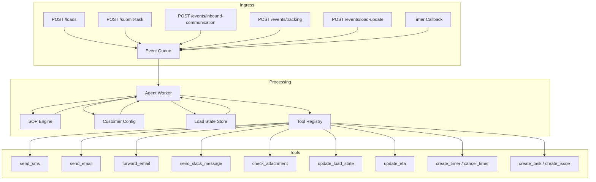
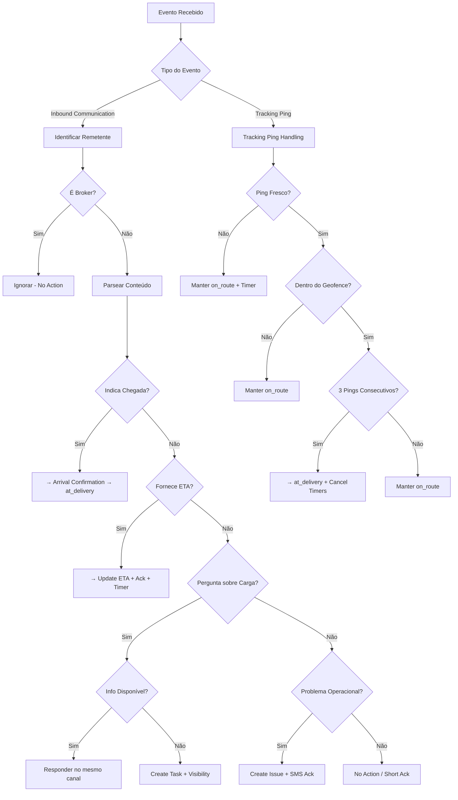
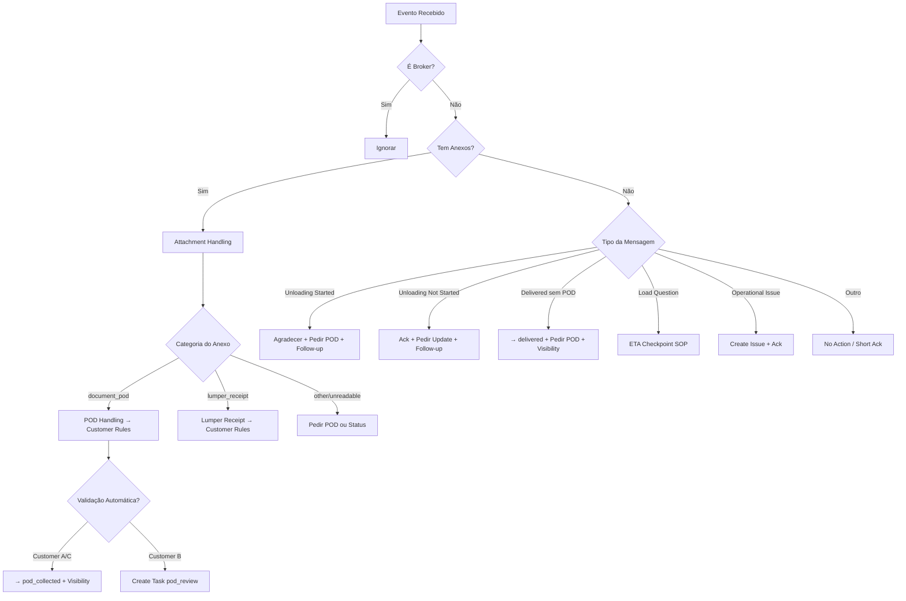
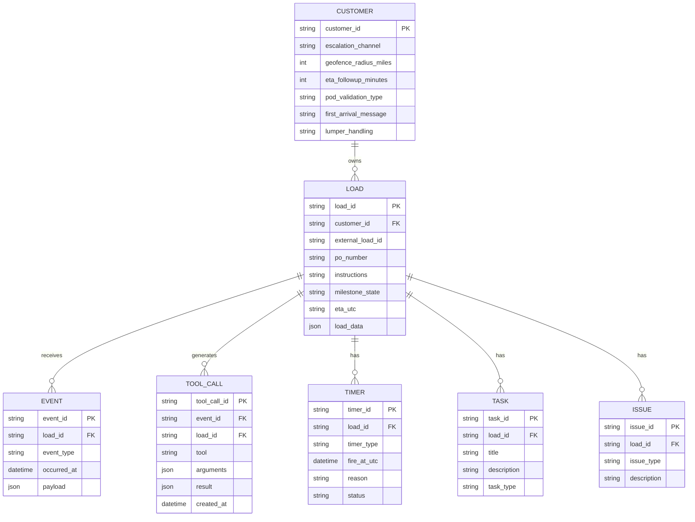
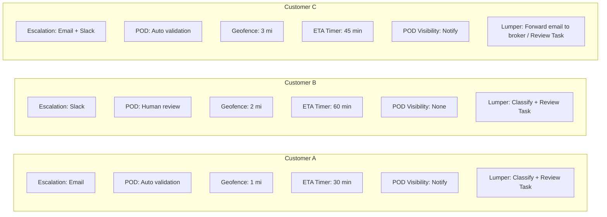
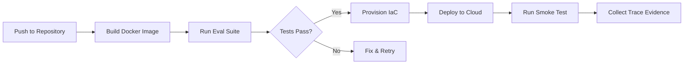
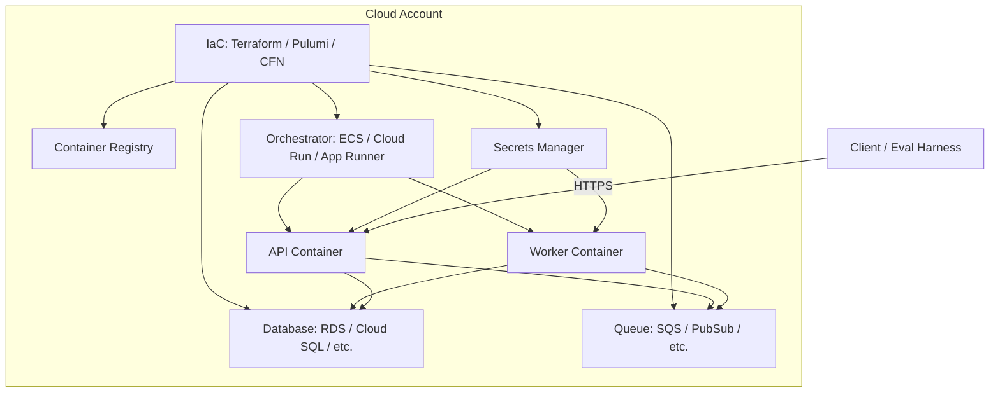

# FreightHero — Documentação de Arquitetura do Sistema

> **Versão:** 1.1  
> **Data:** 7 de junho de 2026  
> **Status:** Especificação / Challenge Repository (implementação pendente)  
> **Classificação:** Documento de referência arquitetural  
> **Veja também:** [Arquitetura de Memória](memory-architecture.md) | [ADRs de Memória](adrs/memory-adrs.md)

---

## 1. Visão Geral do Sistema

### Objetivo do Sistema

O **FreightHero Watchtower** é um sistema de operações AI-driven para workflows de corretagem de frete (freight brokerage). O sistema recebe eventos de carga, pings de rastreamento GPS, comunicações inbound de motoristas/despachantes/brokers, e follow-ups agendados, utilizando agentes baseados em SOPs (Standard Operating Procedures) para decidir se deve responder, atualizar estado, criar tarefas para operadores humanos, criar issues, agendar follow-ups ou ignorar o evento.

### Problema de Negócio Resolvido

A corretagem de frete opera com alto volume de cargas simultâneas, cada uma exigindo monitoramento contínuo de ETA, confirmação de entrega, coleta de POD (Proof of Delivery), e tratamento de exceções operacionais. Operadores humanos não conseguem escalar para monitorar todas as cargas em tempo real. O Watchtower automatiza esse monitoramento com agentes AI que seguem procedimentos operacionais padronizados, respeitando regras específicas por cliente.

### Principais Funcionalidades

| # | Funcionalidade | Descrição |
|---|---|---|
| 1 | **ETA Checkpoint** | Monitoramento de ETA de entrega, rastreamento GPS, confirmação de chegada, respostas a perguntas do motorista, e tratamento de exceções operacionais enquanto o motorista está a caminho da entrega |
| 2 | **Confirm Delivery** | Confirmação de descarregamento, coleta/validação de POD, tratamento de recibos de lumper, e gerenciamento de follow-ups após chegada |
| 3 | **Comportamento por Cliente** | Suporte a perfis de comportamento distintos (Customer A, B, C) com diferenças em canal de escalação, validação de POD, geofence, timers, e mensagens |
| 4 | **Comunicação Multicanal** | Respostas via SMS, email, Slack com matching de canal inbound para respostas ao motorista |
| 5 | **Gestão de Timers** | Follow-ups agendados (ETA, POD, status de entrega, clarificação de anexos) |
| 6 | **Escalation Humana** | Criação de tarefas para operadores humanos (Hero) e issues para problemas operacionais críticos |
| 7 | **Agentic Memory** | Sistema de memória de primeira classe com STM, LTM (Episodic, Semantic, Procedural), ferramentas de memória expostas ao agente, e decisão agent-driven sobre o que lembrar/esquecer/resumir/recuperar. Ver [Arquitetura de Memória](memory-architecture.md) |

### Público-Alvo

- **Brokers**: Clientes do FreightHero que precisam de visibilidade sobre cargas em risco
- **Shippers**: Empresas que enviam a carga (clientes dos brokers)
- **Carriers**: Empresas de transporte que movem a carga
- **Dispatchers**: Operadores do lado do carrier que coordenam o motorista
- **Drivers**: Motoristas operando os caminhões
- **Heroes**: Operadores humanos do FreightHero para revisão e follow-up

### Escopo Funcional

O escopo do desafio foca no **ciclo de vida tardio** da carga:

1. Motorista partiu do pickup
2. Motorista está **a caminho da entrega** (on route to delivery)
3. Motorista chegou na entrega (at delivery)
4. Motorista descarrega (delivered)
5. Motorista envia POD (pod_collected)

Estados de milestone suportados:

| Estado | Descrição |
|---|---|
| `on_route_to_delivery` | Motorista está a caminho do local de entrega |
| `at_delivery` | Motorista chegou ao local de entrega |
| `delivered` | Carga foi descarregada |
| `pod_collected` | POD foi coletado e validado |

---

## 2. Arquitetura de Alto Nível

### Estilo Arquitetural

O sistema adota uma arquitetura **desacoplada API-Worker com fila durável**, conforme especificado nos requisitos do desafio:

- **API Layer**: Recebe requisições HTTP e enfileira eventos para processamento assíncrono
- **Queue**: Mecanismo de async work durável que desacopla API de execução do agente
- **Worker/Agent Layer**: Consome eventos da fila, executa lógica SOP-driven com isolamento por carga
- **State Store**: Persistência de estado por carga fora da memória do processo
- **Tool Layer**: Ferramentas mockadas com registro durável de chamadas

> **Nota:** A implementação concreta (framework web, fila, banco, framework de agente, cloud provider) é de escolha do engenheiro. O repositório atual contém apenas especificações.

### Componentes Principais

| Componente | Responsabilidade |
|---|---|
| **API Gateway** | Expõe endpoints REST write-only, valida payloads via JSON Schema, enfileira eventos |
| **Event Queue** | Fila durável que desacopla API de processamento, garante isolamento por carga |
| **Load State Store** | Persistência de estado por carga (milestone, ETA, dados, sessão de curto prazo) |
| **Agent Worker** | Consome eventos, seleciona branch SOP, invoca ferramentas, atualiza estado, decide operações de memória |
| **SOP Engine** | Motor de seleção de branch baseado em SOPs e regras por cliente |
| **Tool Registry** | Registro durável de todas as chamadas de ferramentas com load_id, event_id, timestamp |
| **Timer Scheduler** | Gerenciamento de follow-ups agendados (re-entrada como eventos time-based) |
| **Customer Config** | Configuração declarativa de comportamento por cliente |
| **Memory System** | Sistema de memória agentic de primeira classe — STM (LangGraph Checkpointer), LTM (PostgreSQL + PGVector + LangMem), ferramentas de memória expostas ao agente. Ver [Arquitetura de Memória](memory-architecture.md) |

### Fluxo Geral de Execução



### Fluxo de Decisão do Agente (ETA Checkpoint)



### Fluxo de Decisão do Agente (Confirm Delivery)



---

## 3. Estrutura do Repositório

| Diretório | Responsabilidade |
|---|---|
| `docs/` | Documentação do projeto |
| `docs/adrs/` | Architecture Decision Records (vazio) |
| `docs/artifacts/` | Artefatos do desafio: README, customer expectations, notion, rubric |
| `docs/diagrams/` | Schemas e diagramas (JSON Schema de input) |
| `docs/specs/` | Especificações de SOPs e casos de teste |
| `docs/wiki/` | Wiki interna (ferramentas mockadas) |
| `.env` | Variáveis de ambiente (vazio) |

### Detalhamento dos Arquivos

| Arquivo | Descrição |
|---|---|
| `docs/background.md` | Conceitos de frete, papéis, ciclo de vida da carga, regras de comunicação |
| `docs/artifacts/README.md` | Descrição completa do desafio técnico (contexto, requisitos, entrega) |
| `docs/artifacts/customer-expectations.md` | Matriz de comportamento por cliente (A, B, C) e guardrails de comunicação |
| `docs/artifacts/notion.md` | Cópia do desafio técnico (duplicata do README) |
| `docs/artifacts/rubric.md` | Critérios de avaliação da submissão |
| `docs/diagrams/challenge-input.schema.json` | JSON Schema para validação dos payloads de API |
| `docs/specs/on_route_to_delivery_eta_checkpoint.md` | SOP do workflow ETA Checkpoint |
| `docs/specs/confirm_delivery.md` | SOP do workflow Confirm Delivery |
| `docs/specs/test-cases.json` | Casos de teste visíveis com eventos e resultados esperados |
| `docs/wiki/tools.md` | Contratos das ferramentas mockadas |

---

## 4. Tecnologias Utilizadas

### Tecnologias Especificadas (Requeridas)

| Categoria | Tecnologia | Versão | Observação |
|---|---|---|---|
| Linguagem | Python | — | Obrigatória para implementação da aplicação |
| Web Framework | A escolher | — | FastAPI, Flask, Django, etc. |
| Banco de Dados | A escolher | — | Para persistência de estado por carga |
| Fila/Queue | A escolher | — | Para desacoplamento API-Worker |
| Agent Framework | A escolher | — | LangChain, LangGraph, etc. |
| Cloud Provider | A escolher | — | AWS, GCP, Azure |
| Containerização | Docker | — | Obrigatória |
| IaC | A escolher | — | Terraform, CloudFormation, Pulumi, etc. |

> **Nota:** O repositório atual contém apenas especificações. As tecnologias concretas serão definidas durante a implementação.

### Tecnologias de Observabilidade (Sugeridas)

| Categoria | Opções Sugeridas |
|---|---|
| Tracing | LangSmith, OpenTelemetry, Honeycomb, Datadog |
| Logs | Structured logs (JSONL) com load_id, event_id, SOP branch, tool calls |

---

## 5. Dependências Externas

| Dependência | Tipo | Finalidade |
|---|---|---|
| LLM Provider (OpenAI, Anthropic, etc.) | API Externa | Inferência do agente AI para seleção de branch SOP e geração de respostas |
| LLM Fallback Provider | API Externa | Estratégia de fallback quando provider primário falha |
| GPS/Tracking Providers | API Externa | Pings de rastreamento (mockados no desafio) |
| SMS Gateway | API Externa | Envio de SMS para motoristas (mockado) |
| Email Service | API Externa | Envio de emails operacionais (mockado) |
| Slack API | API Externa | Notificações internas/broker (mockado) |

> **Nota:** Todas as integrações externas são mockadas no escopo do desafio. As ferramentas mockadas devem validar inputs, retornar resultados estruturados, e registrar chamadas duráveis.

---

## 6. Modelo de Dados

### Entidades Principais

| Entidade | Descrição |
|---|---|
| **Load** | Carga/shipment com pickup e delivery stops, dados do cliente, estado de milestone |
| **Customer** | Perfil de cliente (A, B, C) com regras de comportamento específicas |
| **Event** | Evento inbound (comunicação, tracking, load update, timer callback) |
| **Inbound Communication** | Mensagem SMS/email com remetente, canal, conteúdo e anexos |
| **Tracking Ping** | Dados GPS com lat, lng, distância ao delivery, sequência |
| **Attachment** | Anexo com ID, nome, MIME type e classificação mock |
| **Tool Call Record** | Registro durável de cada chamada de ferramenta |
| **Timer** | Follow-up agendado com tipo, horário de disparo e motivo |
| **Task** | Tarefa humana não-urgente (missing_load_info, pod_review, lumper_review, etc.) |
| **Issue** | Problema operacional urgente (equipment_failure, accident, etc.) |
| **Load State** | Estado de milestone: on_route_to_delivery → at_delivery → delivered → pod_collected |
| **STM Item** | Item de memória de curto prazo (contexto de trabalho por sessão de carga) |
| **LTM Memory** | Memória de longo prazo (episodic, semantic, procedural) com embeddings para busca semântica |
| **Memory Operation** | Log de operações de memória (add, retrieve, update, delete, summarize, filter) |

### Diagrama ERD



### Schemas de Input (JSON Schema)

O contrato de input é definido em `challenge-input.schema.json` com os seguintes tipos:

| Tipo | Campos Obrigatórios |
|---|---|
| `load_seed_request` | `load_id`, `customer_id`, `load_data` |
| `submit_task_request` | `task_uuid`, `load_id`, `customer_id`, `task_instruction_type`, `requested_at` |
| `inbound_communication_event` | `event_id`, `event_type`, `load_id`, `customer_id`, `occurred_at`, `inbound_communication` |
| `tracking_event` | `event_id`, `event_type`, `load_id`, `customer_id`, `occurred_at`, `tracking` |
| `load_update_event` | `event_id`, `event_type`, `load_id`, `customer_id`, `occurred_at`, `load_update` |

### Customer IDs Suportados

| ID | Descrição |
|---|---|
| `customer_a` | Escalação por email, POD automático, geofence 1 milha, timer 30 min |
| `customer_b` | Escalação por Slack, POD com revisão humana, geofence 2 milhas, timer 60 min |
| `customer_c` | Escalação email + Slack, POD automático, geofence 3 milhas, timer 45 min |

---

## 7. Fluxos de Negócio

### Fluxo 1: ETA Checkpoint

| Aspecto | Descrição |
|---|---|
| **Entrada** | Eventos: inbound communication (SMS/email), tracking pings, load updates, timer callbacks |
| **Processamento** | Identificar tipo de evento → Selecionar branch SOP → Aplicar regras do cliente → Invocar ferramentas → Atualizar estado |
| **Saída** | SMS/email de resposta, atualização de ETA, atualização de estado, criação de timers, criação de tasks/issues, ou no-action |

**Branches do SOP:**

| Branch | Gatilho | Ações Típicas |
|---|---|---|
| Tracking Ping Handling | GPS ping recebido | Verificar frescor, geofence, 3 pings consecutivos → at_delivery |
| Arrival Confirmation | Motorista diz "arrived" | update_load_state → at_delivery, cancel_timers, iniciar confirm delivery |
| Driver Provides ETA | Motorista fornece horário | update_eta, send_sms ack, create_timer follow-up |
| Load Information Question | Motorista pergunta endereço, etc. | Responder com info disponível ou create_task + visibility |
| Operational Issue | Quebra, acidente, etc. | create_issue, send_sms ack breve |
| Broker Messages | Broker envia mensagem | Ignorar (no action, registrar motivo) |
| No Action | Thank-you, duplicata, etc. | Registrar motivo de no-action |

### Fluxo 2: Confirm Delivery

| Aspecto | Descrição |
|---|---|
| **Entrada** | Eventos após chegada: inbound communication, attachments, timer callbacks |
| **Processamento** | Identificar tipo → Selecionar branch SOP → Aplicar regras do cliente → Invocar ferramentas → Atualizar estado |
| **Saída** | Mensagens de follow-up, validação de POD, criação de tasks de revisão, atualização de estado, visibility notifications |

**Branches do SOP:**

| Branch | Gatilho | Ações Típicas |
|---|---|---|
| First Arrival Contact | Início do workflow | Mensagem de chegada conforme cliente, follow-up de status |
| POD Document | Anexo classificado como POD | Validação (auto/humana), update_load_state, visibility |
| Lumper Receipt | Anexo classificado como lumper | Classificar, review task, regras de forwarding por cliente |
| Unloading Started | Motorista diz descarregando | Agradecer, pedir POD, follow-up |
| Unloading Not Started | Motorista esperando | Ack, pedir update, follow-up |
| Delivered Without POD | Motorista diz entregue sem POD | update_load_state → delivered, pedir POD, visibility |
| Operational Issue | Problema na entrega | create_issue, ack breve |
| Broker Messages | Broker envia mensagem | Ignorar |

### Fluxo 3: Matriz de Comportamento por Cliente



---

## 8. APIs e Interfaces

### Endpoints Obrigatórios

| Método | Endpoint | Descrição | Content-Type |
|---|---|---|---|
| `POST` | `/loads` | Criar/seed uma carga com customer_id e dados iniciais | `application/json` |
| `POST` | `/submit-task` | Submeter uma tarefa de workflow para uma carga existente | `application/json` |
| `POST` | `/events/inbound-communication` | Enfileirar mensagem inbound (SMS/email) | `application/json` |
| `POST` | `/events/tracking` | Enfileirar ping de rastreamento GPS | `application/json` |
| `POST` | `/events/load-update` | Enfileirar atualização de dados/milestone da carga | `application/json` |

> **Nota:** Endpoints de leitura (GET) NÃO são necessários.

### Detalhamento dos Endpoints

#### `POST /loads`

**Input:**

```json
{
  "load_id": "string (required, min 1)",
  "customer_id": "customer_a | customer_b | customer_c (required)",
  "load_data": {
    "external_load_id": "string (required)",
    "po_number": "string",
    "instructions": "string",
    "companies": {
      "broker": { "name": "string", "uuid": "string" },
      "shipper": { "name": "string", "uuid": "string" },
      "carrier": { "name": "string", "uuid": "string" }
    },
    "contacts": {
      "driver": { "first_name": "string", "last_name": "string", "phone": "string", "email": "string", "uuid": "string" },
      "dispatcher": { "first_name": "string", "last_name": "string", "phone": "string", "email": "string", "uuid": "string" },
      "broker": { "first_name": "string", "last_name": "string", "phone": "string", "email": "string", "uuid": "string" }
    },
    "stops": [
      {
        "stop_id": "string (required)",
        "type": "pickup | delivery (required)",
        "status": "string",
        "address": { "line_1": "string", "city": "string", "state": "string", "postal_code": "string", "country": "string" },
        "appointment": { "type": "fixed | window | fcfs", "start_utc": "ISO datetime", "end_utc": "ISO datetime", "timezone": "string" },
        "coordinates": { "lat": "number", "lng": "number" },
        "reference_numbers": {}
      }
    ]
  },
  "initial_state": "on_route_to_delivery | at_delivery | delivered | pod_collected"
}
```

**Output:** Confirmação de criação da carga  
**HTTP Codes:** `201 Created`, `400 Bad Request`, `409 Conflict`

#### `POST /submit-task`

**Input:**

```json
{
  "task_uuid": "string (required)",
  "load_id": "string (required)",
  "customer_id": "customer_a | customer_b | customer_c (required)",
  "task_instruction_type": "delivery_eta_checkpoint | confirm_delivery (required)",
  "requested_at": "ISO datetime (required)",
  "source": "api | operator | system",
  "payload": {}
}
```

**Output:** Confirmação de enfileiramento da tarefa  
**HTTP Codes:** `202 Accepted`, `400 Bad Request`, `404 Load Not Found`

#### `POST /events/inbound-communication`

**Input:**

```json
{
  "event_id": "string (required)",
  "event_type": "inbound_communication (required)",
  "load_id": "string (required)",
  "customer_id": "customer_a | customer_b | customer_c (required)",
  "occurred_at": "ISO datetime (required)",
  "inbound_communication": {
    "channel": "sms | email (required)",
    "sender_type": "driver | dispatcher | carrier | broker | shipper | hero | tool | other (required)",
    "sender_name": "string",
    "content": "string (required)",
    "attachments": [
      {
        "attachment_id": "string (required)",
        "file_name": "string (required)",
        "mime_type": "string",
        "mock_classification": {
          "categories": ["document_pod | lumper_receipt | photo_unloaded | other_document | unreadable"],
          "description": "string"
        }
      }
    ]
  }
}
```

**Output:** Confirmação de enfileiramento do evento  
**HTTP Codes:** `202 Accepted`, `400 Bad Request`

#### `POST /events/tracking`

**Input:**

```json
{
  "event_id": "string (required)",
  "event_type": "tracking (required)",
  "load_id": "string (required)",
  "customer_id": "customer_a | customer_b | customer_c (required)",
  "occurred_at": "ISO datetime (required)",
  "tracking": {
    "tracking_id": "string (required)",
    "lat": "number (required, -90 to 90)",
    "lng": "number (required, -180 to 180)",
    "distance_to_delivery_miles": "number (required, >= 0)",
    "ping_sequence": "integer (required, >= 1)",
    "provider": "string"
  }
}
```

**Output:** Confirmação de enfileiramento  
**HTTP Codes:** `202 Accepted`, `400 Bad Request`

#### `POST /events/load-update`

**Input:**

```json
{
  "event_id": "string (required)",
  "event_type": "load_update (required)",
  "load_id": "string (required)",
  "customer_id": "customer_a | customer_b | customer_c (required)",
  "occurred_at": "ISO datetime (required)",
  "load_update": {
    "milestone_state": "on_route_to_delivery | at_delivery | delivered | pod_collected",
    "load_data_patch": {},
    "reason": "string"
  }
}
```

**Output:** Confirmação de enfileiramento  
**HTTP Codes:** `202 Accepted`, `400 Bad Request`

### Ferramentas Mockadas (Interfaces Internas)

| Ferramenta | Argumentos Obrigatórios | Resultado Esperado |
|---|---|---|
| `send_sms` | `recipient` (driver/dispatcher), `message` | `{ ok, channel: "sms", message_id }` |
| `send_email` | `recipient`, `subject`, `body` | `{ ok, channel: "email", message_id }` |
| `forward_email` | (nenhum - usa contexto do email atual) | `{ ok, channel: "email", message_id }` |
| `send_slack_message` | `audience` (internal/broker/customer), `message`, `escalation_type?` | `{ ok, channel: "slack", message_id }` |
| `check_attachment` | `attachment_id` | `{ ok, attachment_id, categories[], description }` |
| `update_load_state` | `target_state`, `reason` | `{ ok, previous_state, new_state }` |
| `update_eta` | `target_location`, `eta_utc`, `source` | `{ ok, target_location, eta_utc }` |
| `create_timer` | `timer_type`, `fire_at_utc`, `reason` | `{ ok, timer_id }` |
| `cancel_timer` | `timer_id` | `{ ok }` |
| `cancel_timers` | `timer_type?` | `{ ok }` |
| `create_task` | `title`, `description`, `task_type` | `{ ok, task_id }` |
| `create_issue` | `issue_type`, `description` | `{ ok, issue_id }` |

### Ferramentas de Memória (Agentic Memory)

> Documentação completa em [Arquitetura de Memória](memory-architecture.md)

| Ferramenta | Argumentos Obrigatórios | Descrição |
|---|---|---|
| `MemoryAdd` | `memory_type`, `scope`, `scope_id`, `content`, `content_type` | Armazena nova informação na memória (STM, Episodic, Semantic, Procedural) |
| `MemoryRetrieve` | `query`, `memory_types`, `scope`, `scope_id`, `limit` | Recupera informações relevantes da memória (busca híbrida: exact + semantic) |
| `MemoryUpdate` | `memory_id`, `content?`, `confidence?`, `relevance_score?` | Atualiza uma memória existente |
| `MemoryDelete` | `memory_id` ou `scope` + `scope_id`, `reason` | Remove memória obsoleta (agente deve fornecer motivo) |
| `MemorySummarize` | `memory_type`, `scope_id`, `strategy`, `preserve_recent_n` | Comprime contexto de memória, reduzindo tokens |
| `MemoryFilter` | `memory_type`, `scope_id`, `filter_criteria` | Remove informações irrelevantes da memória de trabalho |

**Formato do Tool Call Record:**

```json
{
  "tool_call_id": "uuid",
  "event_id": "string",
  "load_id": "string",
  "tool": "send_sms",
  "arguments": {},
  "result": {},
  "created_at": "ISO datetime"
}
```

---

## 9. Segurança

| Mecanismo | Implementação |
|---|---|
| Autenticação | > Informação não identificada no repositório. A implementação deve definir estratégia de autenticação para os endpoints da API. |
| Autorização | > Informação não identificada no repositório. Deve haver controle de acesso por customer_id/load_id. |
| Criptografia | > Informação não identificada no repositório. TLS para API em produção é esperado. |
| Gestão de Segredos | Especificado: "Secrets are not committed and are handled sensibly". Arquivo `.env` presente mas vazio. |
| Controle de Acesso | > Informação não identificada no repositório. Least-privilege é mencionado como requisito. |
| Auditoria | Tool Call Records servem como trilha de auditoria de ações do agente. Cada chamada é registrada com load_id, event_id, timestamp. |
| Validação de Input | JSON Schema (`challenge-input.schema.json`) define contratos de validação para todos os endpoints. |

### Guardrails de Comunicação (Segurança Operacional)

| Regra | Implementação |
|---|---|
| Não inventar informações | Agente não deve fabricar endereços, horários, referências, contatos, status de pagamento ou políticas |
| Não aprovar pagamentos | Agente não deve aprovar lumper, detention ou outros pagamentos |
| Não revelar internals | Agente não deve expor raciocínio interno, ferramentas, filas, scoring |
| Ignorar brokers | Mensagens de broker são ignoradas no desafio (no reply, no action trigger) |
| Matching de canal | Respostas ao motorista devem usar o mesmo canal inbound (SMS→SMS, email→email) |

---

## 10. Tratamento de Erros

| Aspecto | Estratégia |
|---|---|
| **Model Fallback** | Estratégia de fallback configurável: provider fallback real, mock fallback configurável, ou ambos. Requisito obrigatório. |
| **Tool Failure** | > Informação não identificada no repositório. Ferramentas mockadas retornam `{ ok: true }` por padrão. Implementação deve definir comportamento em falha. |
| **Invalid Input** | Validação via JSON Schema nos endpoints da API. HTTP 400 para payloads inválidos. |
| **Load Not Found** | HTTP 404 para submit-task em carga inexistente. |
| **Concurrency** | Eventos para a mesma carga devem ser isolados de outras cargas e tratados com segurança sob concorrência. Requisito obrigatório. |
| **Stale Tracking** | Pings stale mantêm a carga em on_route_to_delivery e continuam o processo de follow-up de ETA. |
| **Ambiguous ETA** | Agente deve fazer uma pergunta curta de clarificação quando o ETA é ambíguo e o motorista pode razoavelmente responder. |
| **Ambiguous Attachments** | Se anexo não é POD nem lumper, pedir POD ou status de descarregamento conforme contexto. |

---

## 11. Observabilidade

### Requisitos de Observabilidade

| Aspecto | Requisito |
|---|---|
| **Structured Logs** | Logs com `load_id`, `event_id`/request ID, event type, SOP branch selecionado, tool calls, e mudança de estado final |
| **Tracing** | Deve ser possível responder: "Por que o agente chamou estas ferramentas para este evento?" |
| **Trace Surfaces** | LangSmith, OpenTelemetry, Honeycomb, Datadog, ou equivalente; cloud log links; JSONL exportado |
| **SOP Branch Visibility** | Logs/traces devem mostrar o branch SOP selecionado e a justificativa |
| **Error Visibility** | Caminhos de erro devem ser visíveis e acionáveis |
| **Cost/Latency** | Metadados de custo/latência do model provider devem ser capturados ou discutidos |

### Formato de Log Estruturado (Sugerido)

```json
{
  "timestamp": "ISO datetime",
  "load_id": "string",
  "event_id": "string",
  "event_type": "string",
  "sop_branch": "string",
  "tool_calls": ["tool_name"],
  "state_change": { "from": "previous", "to": "new" },
  "reason": "string"
}
```

---

## 12. Estratégia de Testes

| Tipo | Cobertura Identificada |
|---|---|
| **Testes de Casos Visíveis** | 8 casos em `test-cases.json` cobrindo: pergunta de carga (info disponível e ausente), quebra de caminhão, ETA do motorista, tracking geofence (3 pings), chegada do motorista, POD enviado, broker ignorado |
| **Assertions de Tool Calls** | Cada caso define `required_tool_calls` e `forbidden_tool_calls` |
| **Assertions de Estado** | Cada caso define `expected_state` (milestone state resultante) |
| **Testes de Customer-Specific** | Casos cobrem customer_a, customer_b, customer_c |
| **Testes de Hidden Variants** | > Informação não identificada no repositório. O desafio menciona "hidden tests may vary customer behavior, channel, timing, attachments, and event order." |
| **Testes de Integração** | > Informação não identificada no repositório. Requisito: eval/test harness executável localmente com comando único. |
| **Testes E2E** | > Informação não identificada no repositório. Requisito: assertions sobre tool calls e state transitions para casos visíveis. |
| **Cobertura** | > Informação não identificada no repositório. Requisito: eval report com pass/fail, gaps, e áreas de risco para hidden cases. |

### Casos de Teste Visíveis

| ID | Título | Cliente | Estado Inicial | Ferramentas Requeridas | Ferramentas Proibidas |
|---|---|---|---|---|---|
| `3b` | Driver asks for delivery address (info available) | A | on_route | `send_sms` (contains address) | create_task, create_issue, send_email, forward_email, send_slack |
| `3c` | Driver asks for missing info | B | on_route | `send_sms`, `create_task` (missing_load_info), `send_slack_message` (broker) | create_issue, update_load_state |
| `3d` | Truck breakdown | A | on_route | `create_issue` (equipment_failure), `send_sms` (review) | create_task, update_eta, update_load_state |
| `3f` | Driver provides valid ETA | C | on_route | `update_eta`, `send_sms` (updated), `create_timer` (eta_followup) | create_issue, create_task, update_load_state |
| `3h` | 3 fresh pings inside geofence | B | on_route | `update_load_state` (at_delivery), `cancel_timers` | create_issue, create_task, update_eta |
| `3i` | Driver says arrived (no tracking) | A | on_route | `update_load_state` (at_delivery), `send_sms` (POD), `cancel_timers` | create_issue, create_task, update_eta |
| `3j` | Driver sends POD (no tracking) | C | on_route | `check_attachment`, `update_load_state` (pod_collected), `send_sms` (Thank) | create_issue, update_eta |
| `3k` | Broker email (ignore) | A | on_route | (none) | send_sms, send_email, forward_email, send_slack, create_task, create_issue, update_eta, update_load_state |

---

## 13. CI/CD

> Informação não identificada no repositório. Nenhum pipeline de CI/CD, configuração de build, ou processo de deploy automatizado foi encontrado.

### Requisitos de CI/CD (Especificados)

| Aspecto | Requisito |
|---|---|
| **Build** | Dockerfile(s) com instruções de execução local |
| **Testes** | Eval/test harness executável localmente com comando único |
| **Deploy** | Infraestrutura como código (IaC) para provisionar recursos cloud |
| **Cloud Endpoint** | API endpoint público do serviço deployado |
| **Evidence** | Logs/traces de pelo menos um test run deployado |

### Fluxo de CI/CD Esperado



---

## 14. Infraestrutura

### Requisitos de Infraestrutura (Especificados)

| Componente | Requisito | Status |
|---|---|---|
| **Docker** | Containerização obrigatória | Não implementado |
| **Cloud** | Deploy em conta cloud real | Não implementado |
| **IaC** | Infraestrutura como código (Terraform, CloudFormation, etc.) | Não implementado |
| **API Endpoint** | Endpoint público acessível | Não implementado |
| **Secrets** | Segredos não commitados, gerenciados sensatamente | `.env` vazio presente |

### Arquitetura de Implantação Esperada



---

## 15. Requisitos Não Funcionais

| Categoria | Evidência |
|---|---|
| **Escalabilidade** | Arquitetura desacoplada API-Worker com fila durável permite escalar workers independentemente. Isolamento por carga previne contenção entre cargas diferentes. |
| **Performance** | Processamento assíncrono via fila. Timers com follow-up configurável (30/45/60 min). Requisito de model fallback para degradação controlada. |
| **Segurança** | Guardrails de comunicação (não inventar info, não aprovar pagamentos, não revelar internals). Validação de input via JSON Schema. Segredos não commitados. |
| **Disponibilidade** | Fila durável garante que eventos não são perdidos. Model fallback strategy para resiliência do LLM. |
| **Observabilidade** | Structured logs com load_id, event_id, SOP branch, tool calls. Tool Call Records como trilha de auditoria. Requisito de trace links. |
| **Manutenibilidade** | SOPs separados de código. Customer-specific behavior deve ser declarativo, não hardcoded. Documentação de gaps e tradeoffs esperada. |
| **Testabilidade** | Tool calls registrados e testáveis. Assertions sobre required/forbidden tool calls. Eval harness com comando único. |
| **Portabilidade** | Containerização Docker. IaC para qualquer cloud. Python como linguagem portável. |

---

## 16. Riscos Técnicos

| Risco | Severidade | Impacto | Mitigação Sugerida |
|---|---|---|---|
| **Comportamento de LLM não determinístico** | Alto | Respostas inconsistentes podem falhar testes de tool calls e conteúdo de mensagens | Prompt engineering rigoroso, evals abrangentes, fallback strategy |
| **Hardcoded customer behavior** | Alto | Dificulta escalar para novos clientes; viola requisito de "no one-off branches" | Customer config declarativo, composição dinâmica de SOP fragments |
| **Concorrência entre eventos da mesma carga** | Médio | Race conditions podem causar estado inconsistente | Isolamento por load_id, locking ou serialização de eventos por carga |
| **Hidden test variants** | Médio | Casos não visíveis podem ter variações de canal, timing, anexos, ordem de eventos | Design genérico baseado em SOPs, não em casos específicos |
| **Dependência de LLM provider** | Médio | Falha do provider primário interrompe processamento | Model fallback strategy (requisito obrigatório) |
| **Timer accuracy** | Baixo | Follow-ups agendados podem não disparar no momento exato | Job table, delayed queue, ou cloud scheduler com tolerância razoável |
| **Ambiguous input classification** | Médio | Agente pode selecionar branch SOP errado para inputs ambíguos | Clarification questions, logging de justificativa, evals de edge cases |
| **Falta de testes de integração** | Médio | Comportamento end-to-end pode não ser validado | Eval harness com assertions sobre tool calls e state transitions |
| **Crescimento não limitado de LTM** | Médio | Memórias de longo prazo podem crescer indefinidamente, degradando performance | Políticas de retenção (ADR-009), maintenance jobs, sumarização automática |
| **Custo de embeddings para memória semântica** | Médio | Cada memória adicionada requer embedding, aumentando custo e latência | Batch embedding, cache de embeddings, sumarização antes de armazenar |
| **Perda de contexto em sumarização** | Médio | Sumarização de STM pode perder detalhes importantes | Preservação obrigatória de state changes e tool calls; evals de sumarização |
| **Isolamento de memória entre clientes** | Alto | Vazamento de regras de um cliente para outro pode causar comportamento incorreto | Escopo estrito por customer_id; testes de isolamento (cross-customer) |

---

## 17. Decisões Arquiteturais (ADR)

### ADR-001: Desacoplamento API-Worker via Fila Durável

**Contexto**

O sistema precisa receber eventos via API HTTP e processá-los com agentes AI que podem levar tempo variável. O processamento síncrono bloquearia a API e criaria acoplamento temporal.

**Decisão**

API e execução do agente são desacoplados por uma fila ou mecanismo durável de async work. A API apenas valida e enfileira; workers consomem e processam.

**Consequências**

- (+) API responde rapidamente (202 Accepted)
- (+) Workers podem escalar independentemente
- (+) Fila durável garante persistência de eventos
- (-) Complexidade adicional de infraestrutura (fila)
- (-) Latência adicional entre recebimento e processamento
- (-) Necessidade de monitoramento de depth da fila

### ADR-002: Estado por Carga Persistido Externamente

**Contexto**

O agente precisa manter estado de curto prazo por carga (milestone, ETA, contexto de sessão) para que eventos subsequentes possam usar contexto anterior.

**Decisão**

Per-load state é persistido fora da memória do processo em um datastore externo.

**Consequências**

- (+) Estado sobrevive a restarts de worker
- (+) Múltiplos workers podem acessar o mesmo estado
- (+) Estado é inspecionável para debugging
- (-) Latência de leitura/escrita no datastore
- (-) Necessidade de schema de dados e migrações

### ADR-003: Isolamento por Carga sob Concorrência

**Contexto**

Múltiplos eventos para a mesma carga podem chegar simultaneamente. Processamento concorrente sem isolamento pode causar race conditions e estado inconsistente.

**Decisão**

Eventos para a mesma carga são isolados de outras cargas e tratados com segurança sob concorrência.

**Consequências**

- (+) Consistência de estado por carga
- (+) Previsibilidade de comportamento
- (-) Possível redução de throughput para cargas com alto volume de eventos
- (-) Necessidade de mecanismo de locking ou serialização

### ADR-004: Comportamento por Cliente Declarativo

**Contexto**

Diferentes clientes (brokers) têm diferenças de comportamento (canal de escalação, validação de POD, geofence, timers, mensagens). Hardcoding essas diferenças em branches if/else não escala.

**Decisão**

Customer-specific behavior deve ser configurável/declarativo, não hardcoded em one-off branches. SOPs descrevem workflow compartilhado; customer expectations descrevem diferenças.

**Consequências**

- (+) Novos clientes podem ser adicionados sem mudança de código
- (+) Diferenças são testáveis e auditáveis
- (+) Escala além de 3 clientes
- (-) Complexidade de design do sistema de configuração
- (-) Necessidade de validação de configurações de cliente

### ADR-005: Ferramentas Mockadas com Registro Durável

**Contexto**

O sistema precisa interagir com serviços externos (SMS, email, Slack, tracking), mas no escopo do desafio essas integrações são mockadas. Ainda assim, as chamadas precisam ser testáveis e auditáveis.

**Decisão**

Ferramentas são mockadas mas devem: validar inputs, retornar resultados estruturados, registrar chamadas duráveis com load_id, event_id, timestamp.

**Consequências**

- (+) Tool calls são testáveis em evals
- (+) Trilha de auditoria completa
- (+) Substituição por integrações reais é transparente
- (-) Mocks podem não cobrir todos os edge cases de produção
- (-) Necessidade de manter formato de registro consistente

### ADR-006 a ADR-010: Arquitetura de Memória Agentic

As decisões arquiteturais relacionadas ao sistema de memória (ADR-006 a ADR-010) estão documentadas em detalhe em:

- **[Arquitetura de Memória](memory-architecture.md)** — Documento completo de design de memória
- **[ADRs de Memória](adrs/memory-adrs.md)** — ADRs detalhados

| ADR | Título | Decisão |
|---|---|---|
| ADR-006 | Memory Storage Strategy | PostgreSQL + PGVector para LTM; LangGraph Checkpointer para STM; Chroma para dev |
| ADR-007 | Memory Retrieval Strategy | Busca híbrida em camadas: exact match (customer rules) + semantic search (learned facts) + agent-driven retrieval |
| ADR-008 | Memory Summarization Strategy | Três estratégias: compress_older (STM), episode_compression (Episodic), relevance_filter (transitions) |
| ADR-009 | Memory Retention Policy | STM: até fim de sessão; Episodic: 30 dias pós-entrega; Semantic: permanente com eviction por confiança |
| ADR-010 | LangChain Memory Selection | LangGraph Checkpointer (STM) + LangMem (LTM) + PGVector (embeddings) + Conversation Summary (compressão) |

---

## 18. Guia de Instalação

> **Nota:** O repositório atual contém apenas especificações e documentação. Não há código implementado para instalação.

### Pré-requisitos (Esperados)

| Requisito | Versão |
|---|---|
| Python | 3.11+ |
| Docker | 20+ |
| Docker Compose | 2+ |
| Cloud CLI (AWS/GCP/Azure) | Última estável |
| Terraform / IaC tool | Última estável |

### Instalação (Esperada)

```bash
# 1. Clone o repositório
git clone <repo-url>
cd freighthero

# 2. Configure variáveis de ambiente
cp .env.example .env
# Editar .env com API keys, database URL, etc.

# 3. Build e execução local com Docker
docker compose up --build

# 4. Verificar saúde do serviço
curl http://localhost:8000/health
```

### Execução do Eval Suite (Esperada)

```bash
# Comando único para rodar todos os testes
make eval
# ou
docker compose run --rm eval
```

> Informação não identificada no repositório: comandos de instalação e execução concretos.

---

## 19. Guia de Desenvolvimento

### Estrutura de Branches

> Informação não identificada no repositório. Nenhuma convenção de branching documentada.

### Convenções de Código

| Convenção | Evidência |
|---|---|
| Linguagem | Python (obrigatória) |
| Validação de Input | JSON Schema ou Pydantic models derivados do schema |
| Tool Call Records | Formato JSON documentado com campos obrigatórios |
| Structured Logs | load_id, event_id, SOP branch, tool calls, state change |
| Customer Config | Declarativo, não hardcoded |

### Padrões de Código (Esperados)

- **SOP-driven**: Lógica do agente segue SOPs, não ad-hoc
- **Customer-agnostic**: Branches genéricos com injeção de customer config
- **Channel-matching**: Respostas ao motorista no mesmo canal inbound
- **Tool recording**: Toda chamada de ferramenta registrada
- **No invention**: Não fabricar informações ausentes
- **No approval**: Não aprovar pagamentos

### Processo de Contribuição

> Informação não identificada no repositório.

### AI Usage Policy

O desafio permite uso de LLM coding assistants. Requer arquivo `AI_USAGE.md` documentando:
- Ferramentas/modelos utilizados
- Partes geradas ou fortemente assistidas
- Decisões tomadas manualmente
- Exemplos onde output gerado por AI foi rejeitado ou corrigido

---

## 20. Roadmap Técnico

| Item | Prioridade | Justificativa |
|---|---|---|
| **Implementação do código-fonte** | P0 | Repositório contém apenas especificações; implementação é o objetivo principal do desafio |
| **API REST com validação JSON Schema** | P0 | Endpoints obrigatórios definidos; validação via schema existente |
| **Worker com processamento SOP-driven** | P0 | Lógica central do sistema; dois workflows (ETA Checkpoint, Confirm Delivery) |
| **Customer config declarativo** | P0 | Diferenças A/B/C devem ser configuráveis, não hardcoded |
| **Model fallback strategy** | P0 | Requisito obrigatório; resiliência do LLM |
| **Persistência de estado por carga** | P0 | Requisito obrigatório; estado fora de memória de processo |
| **Isolamento de concorrência por carga** | P0 | Requisito obrigatório; segurança sob concorrência |
| **Containerização Docker** | P0 | Requisito obrigatório |
| **Deploy cloud com IaC** | P0 | Requisito obrigatório |
| **Eval harness com assertions** | P0 | Requisito obrigatório; 8 casos visíveis + hidden variants |
| **Observabilidade (structured logs + traces)** | P0 | Requisito obrigatório; deve ser possível explicar tool calls |
| **Timer scheduler** | P1 | Follow-ups agendados; pode ser job table, delayed queue, ou scheduler |
| **Session state de curto prazo** | P1 | Contexto entre eventos da mesma carga |
| **POD/BOL handling completo** | P1 | check_attachment, validação, visibility por cliente |
| **Lumper receipt handling** | P1 | Diferenças por cliente (forward email vs review task) |
| **Edge cases e ambiguous inputs** | P2 | Clarification questions, mixed signals, partial info |
| **Hidden test variant preparation** | P1 | Design genérico baseado em SOPs, não em casos específicos |
| **AI_USAGE.md** | P1 | Requisito de submissão |
| **Architecture write-up** | P1 | Requisito de submissão; tradeoffs e gaps |

---

## Limitações e Evidências Analisadas

### Limitações Identificadas

1. **Repositório de especificação**: Este repositório contém apenas documentação, especificações, schemas e casos de teste. Nenhum código-fonte, configuração de infraestrutura, ou pipeline de CI/CD foi encontrado.
2. **Tecnologias não definidas**: Framework web, banco de dados, fila, agent framework, e cloud provider são de escolha do implementador.
3. **ADR vazio**: O diretório `docs/adrs/` está vazio; as ADRs acima foram inferidas dos requisitos.
4. **Sem implementação de segurança**: Nenhum mecanismo de autenticação, autorização ou criptografia está implementado.
5. **Sem CI/CD**: Nenhum pipeline, configuração de build ou deploy automatizado encontrado.
6. **Sem infraestrutura**: Nenhum Dockerfile, Terraform, CloudFormation ou configuração cloud encontrada.

### Evidências Analisadas

| Fonte | Tipo |
|---|---|
| `docs/background.md` | Conceitos de domínio, papéis, ciclo de vida, regras de comunicação |
| `docs/artifacts/README.md` | Requisitos completos do desafio técnico |
| `docs/artifacts/customer-expectations.md` | Matriz de comportamento A/B/C, guardrails |
| `docs/artifacts/rubric.md` | Critérios de avaliação |
| `docs/artifacts/notion.md` | Duplicata do README |
| `docs/specs/on_route_to_delivery_eta_checkpoint.md` | SOP completo do ETA Checkpoint |
| `docs/specs/confirm_delivery.md` | SOP completo do Confirm Delivery |
| `docs/specs/test-cases.json` | 8 casos de teste com eventos e expected outcomes |
| `docs/diagrams/challenge-input.schema.json` | JSON Schema completo dos payloads de API |
| `docs/wiki/tools.md` | Contratos das 12 ferramentas mockadas |
| `.env` | Arquivo vazio |

---

## Mapeamento de Qualidade (Sommerville)

| Atributo | Evidência no Repositório | Avaliação |
|---|---|---|
| **Manutenibilidade** | SOPs separados de código; customer config declarativo; documentação de gaps esperada; memória como ferramentas explícitas | ✅ Design favorece manutenibilidade |
| **Confiabilidade** | Fila durável; model fallback; tool call records; state persistence; checkpointer para STM; LTM em PostgreSQL | ✅ Mecanismos de confiabilidade especificados |
| **Segurança** | Guardrails de comunicação; JSON Schema validation; secrets management; least-privilege; isolamento de memória por escopo | ⚠️ Especificado mas não implementado |
| **Eficiência** | Processamento assíncrono; escalabilidade independente de API/Worker; STM limitado com sumarização; busca híbrida | ✅ Arquitetura favorece eficiência |
| **Usabilidade** | API REST simples; eval harness com comando único; documentação de deploy; ferramentas de memória observáveis | ✅ Design favorece usabilidade operacional |
| **Escalabilidade** | Desacoplamento API-Worker; isolamento por carga; fila durável; PGVector para busca semântica | ✅ Arquitetura favorece escalabilidade |
| **Testabilidade** | Tool call assertions; forbidden tool calls; state assertions; eval harness; memory eval tests (retrieval, forgetting, summarization, long horizon, customer context) | ✅ Design favorece testabilidade |
| **Portabilidade** | Docker; IaC; Python; cloud-agnostic; PostgreSQL + PGVector disponível em todas as clouds | ✅ Arquitetura favorece portabilidade |