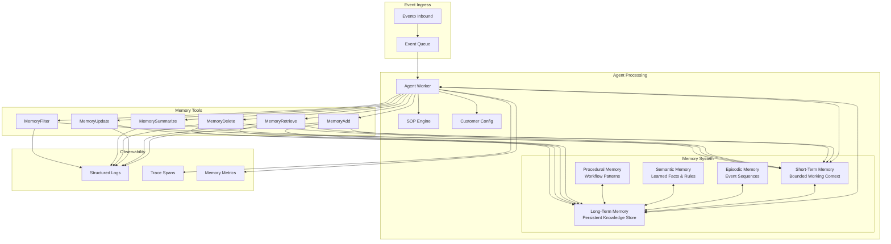
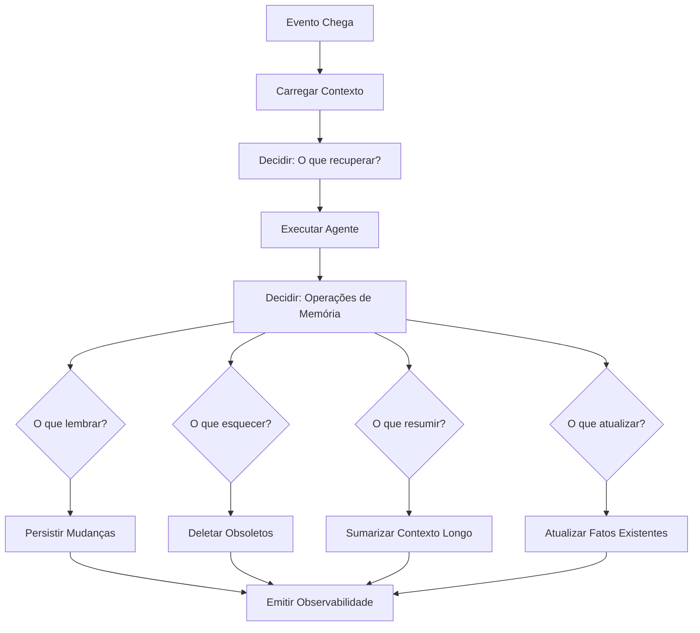
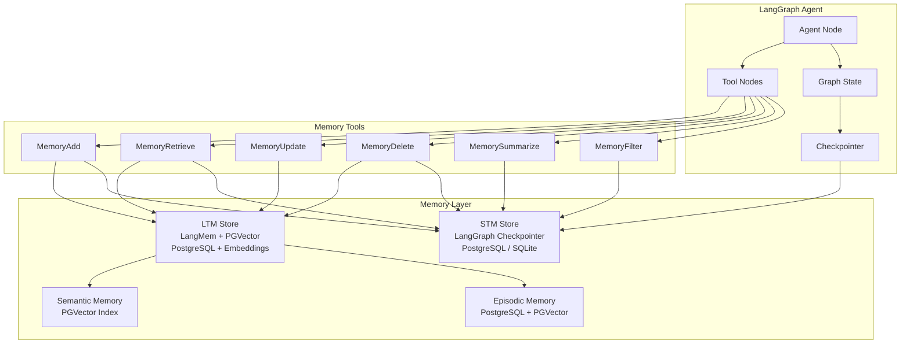
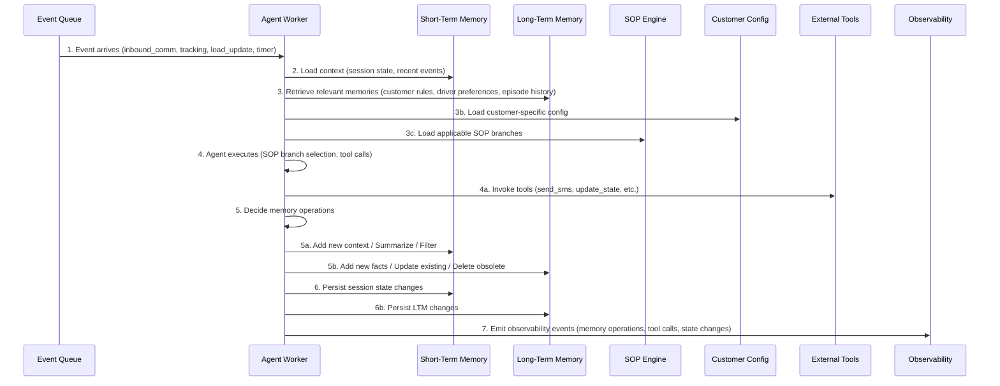
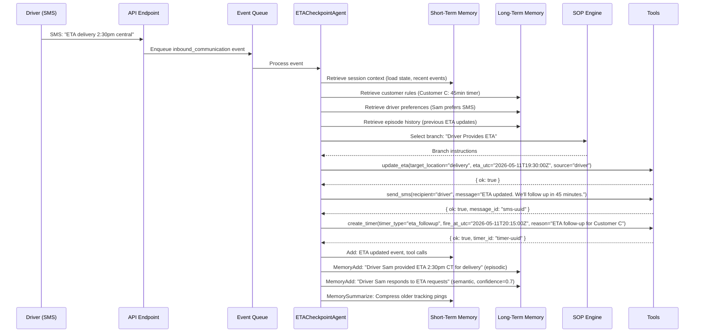
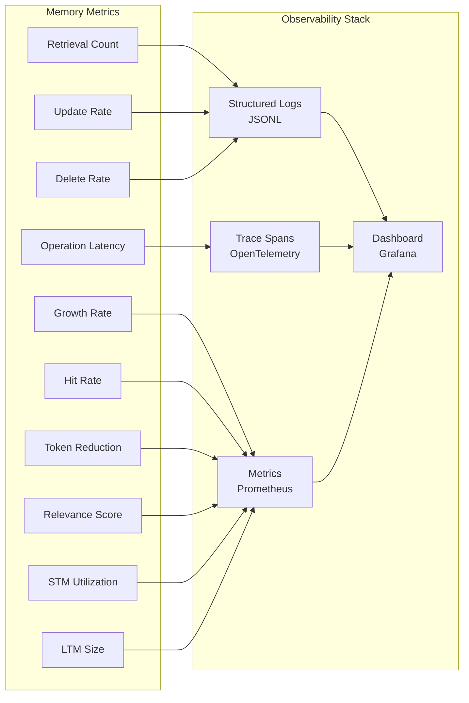
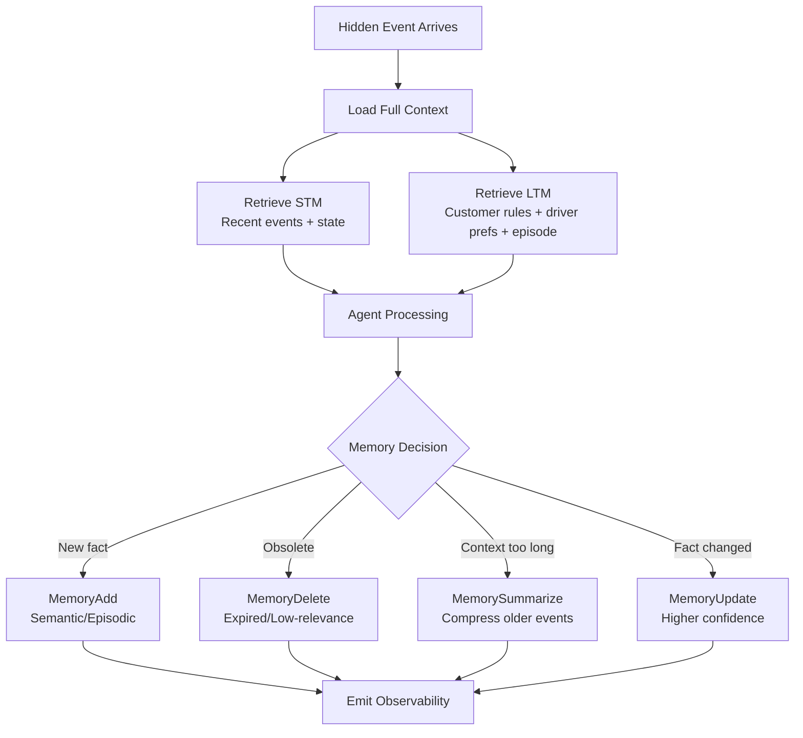

# FreightHero — Agentic Memory Architecture

> **Versão:** 1.0  
> **Data:** 7 de junho de 2026  
> **Status:** Design Document  
> **Referência:** Agentic Memory (AgeMem) — Unified Long-Term and Short-Term Memory Management for LLM Agents  
> **Framework Base:** LangChain / LangGraph

---

## 1. Visão Geral da Arquitetura de Memória

### Princípios Fundamentais

A memória é um componente arquitetural de primeira classe no FreightHero Watchtower. Não é tratada como um histórico de conversação simples ou um vector store passivo. A arquitetura de memória é inspirada no modelo **AgeMem (Agentic Memory)**, que unifica gestão de memória de longo prazo (LTM) e curto prazo (STM), permitindo que o agente decida ativamente o que lembrar, esquecer, resumir e recuperar.

**Princípios diretores:**

1. **Agent-Driven Memory**: O agente decide o que armazenar, recuperar, resumir e esquecer — evitando pipelines de recuperação hardcoded sempre que possível.
2. **Memory as Tools**: Memória é exposta ao agente como ferramentas explícitas (MemoryAdd, MemoryRetrieve, MemoryUpdate, MemoryDelete, MemorySummarize, MemoryFilter).
3. **Bounded Context**: STM tem tamanho limitado e suporta sumarização, poda e compressão de contexto.
4. **Cross-Event Continuity**: LTM persiste entre eventos, tarefas, execuções de workflow e follow-ups agendados.
5. **Observabilidade**: Toda operação de memória é registrada em traces e logs estruturados.
6. **Customer-Aware Retrieval**: Recuperação de memória é escopada por customer_id para aplicar regras específicas.

### Diagrama de Arquitetura de Memória



---

## 2. Tipos de Memória

### 2.1 Short-Term Memory (STM)

**Definição**: Memória de trabalho task-specific, usada durante a execução de um único evento ou sequência curta de eventos para a mesma carga.

| Propriedade | Valor |
|---|---|
| **Persistência** | Por-evento, com opção de manter entre eventos da mesma carga (session) |
| **Escopo** | `load_id` + `session_id` |
| **Tamanho** | Limitado (bounded) — máximo de tokens configurável |
| **Estratégia de Evicção** | LRU + sumarização + poda por relevância |
| **Armazenamento** | Redis (cache) ou in-process com checkpoint |

**Conteúdo típico:**

- Mensagens recentes do driver/dispatcher
- Pings de rastreamento recentes
- Estado ativo do workflow (milestone atual, ETA atual)
- Cálculos de ETA em andamento
- Confirmações de entrega pendentes
- Anexos em processamento
- Contexto da conversação atual

**Operações suportadas:**

| Operação | Descrição |
|---|---|
| `add` | Adiciona item ao STM |
| `retrieve` | Recupera itens por relevância ou recência |
| `summarize` | Comprime N itens em um resumo |
| `filter` | Remove itens irrelevantes |
| `prune` | Remove itens mais antigos quando o limite é atingido |
| `clear` | Limpa STM ao final da sessão ou transição de estado |

**Modelo de Dados STM:**

```python
class STMItem(BaseModel):
    item_id: str
    load_id: str
    session_id: str
    event_id: str
    timestamp: datetime
    content: str
    content_type: Literal["message", "tracking", "state_change", "tool_call", "agent_reasoning"]
    relevance_score: float = 1.0
    token_count: int
    metadata: dict = {}
```

### 2.2 Long-Term Memory (LTM)

**Definição**: Conhecimento persistente que sobrevive entre eventos, tarefas, execuções de workflow e follow-ups agendados.

| Propriedade | Valor |
|---|---|
| **Persistência** | Permanente até exclusão explícita ou expiração por política |
| **Escopo** | `customer_id` (regras), `load_id` (histórico), `driver_id` (preferências) |
| **Tamanho** | Ilimitado com sumarização e arquivamento |
| **Estratégia de Recuperação** | Busca semântica + busca exata + filtros por escopo |
| **Armazenamento** | PostgreSQL (dados estruturados) + Vector Store (embeddings) |

**Conteúdo típico:**

- Preferências do driver (canal preferido, horários, padrões de comunicação)
- Problemas recorrentes de entrega (endereços com acesso difícil, docas específicas)
- Regras específicas do cliente (customer A/B/C behavior matrix)
- Histórico de exceções (breakdowns, atrasos, problemas em facilities)
- Padrões de comunicação (resumo de interações passadas)
- Padrões de entrega (tempo médio de descarregamento, POD turnaround)
- Resumos de interações (compressão de episódios longos)

**Modelo de Dados LTM:**

```python
class LTMMemory(BaseModel):
    memory_id: str
    memory_type: Literal["episodic", "semantic", "procedural"]
    scope: Literal["customer", "load", "driver", "carrier", "global"]
    scope_id: str  # customer_id, load_id, driver_id, etc.
    content: str
    summary: str | None = None
    embedding: list[float] | None = None
    tags: list[str] = []
    source_event_ids: list[str] = []
    created_at: datetime
    updated_at: datetime
    expires_at: datetime | None = None
    relevance_score: float = 1.0
    access_count: int = 0
    last_accessed_at: datetime | None = None
    metadata: dict = {}
```

### 2.3 Episodic Memory

**Definição**: Armazena sequências de eventos, execuções de workflow e histórico de interações.

| Propriedade | Valor |
|---|---|
| **Tipo pai** | LTM |
| **Granularidade** | Por evento ou por episódio (sequência de eventos relacionados) |
| **Escopo** | `load_id` (primário), `driver_id` (secundário) |
| **Sumarização** | Episódios longos são comprimidos em resumos |

**Conteúdo armazenado:**

| Tipo | Exemplo |
|---|---|
| Sequência de eventos | "Driver reported delay → Driver arrived → POD uploaded" |
| Execução de workflow | "ETA Checkpoint executado: branch=driver_provides_eta, tools=[update_eta, send_sms, create_timer]" |
| Histórico de interações | "Driver Sam enviou 3 SMS em 2 horas, todas respondidas no mesmo canal" |
| Exceções operacionais | "Truck breakdown reportado às 17:15, issue criado, driver notificado" |

**Modelo de Dados:**

```python
class EpisodicMemory(LTMMemory):
    memory_type: Literal["episodic"] = "episodic"
    episode_type: Literal["event_sequence", "workflow_execution", "interaction_history", "operational_exception"]
    sequence: list[dict] = []  # Ordered list of events/actions
    outcome: str | None = None  # Final result of the episode
    duration_minutes: float | None = None
```

**Ciclo de vida:**

1. Evento chega → Episódio é criado ou estendido
2. Workflow executa → Passos são adicionados ao episódio
3. Episódio é fechado → Resumo é gerado
4. Resumo é armazenado em LTM com embedding
5. Episódio original pode ser arquivado ou podado

### 2.4 Semantic Memory

**Definição**: Armazena fatos aprendidos, regras do cliente, interpretações de SOP e conhecimento reutilizável.

| Propriedade | Valor |
|---|---|
| **Tipo pai** | LTM |
| **Granularidade** | Fatos individuais ou regras compostas |
| **Escopo** | `customer_id` (regras), `driver_id` (preferências), `global` (conhecimento geral) |
| **Atualização** | Incremental — novos fatos são adicionados, fatos conflitantes são atualizados |

**Conteúdo armazenado:**

| Tipo | Exemplo |
|---|---|
| Regras do cliente | "Customer A prefere escalação por email" |
| Preferências do driver | "Driver Sam prefere comunicação por SMS" |
| Conhecimento de SOP | "Para Customer B, POD requer revisão humana" |
| Padrões de entrega | "Delivery stop em Dallas tem tempo médio de descarregamento de 2 horas" |
| Regras de geofence | "Customer C tem geofence de 3 milhas para confirmação de chegada" |
| Regras de timer | "Customer A usa timer de follow-up ETA de 30 minutos" |

**Modelo de Dados:**

```python
class SemanticMemory(LTMMemory):
    memory_type: Literal["semantic"] = "semantic"
    fact_type: Literal["customer_rule", "driver_preference", "sop_interpretation", "delivery_pattern", "geofence_rule", "timer_rule", "general"]
    confidence: float = 1.0
    source: str | None = None  # "customer_expectations", "sop", "learned", "operator"
    valid_from: datetime | None = None
    valid_until: datetime | None = None
```

### 2.5 Procedural Memory

**Definição**: Armazena padrões de execução de workflow, estratégias de resolução bem-sucedidas e playbooks operacionais recorrentes.

| Propriedade | Valor |
|---|---|
| **Tipo pai** | LTM |
| **Granularidade** | Por workflow + branch |
| **Escopo** | `customer_id` (procedimentos específicos), `global` (procedimentos compartilhados) |
| **Atualização** | Baseada em sucesso/falha de resoluções anteriores |

**Conteúdo armazenado:**

| Tipo | Exemplo |
|---|---|
| Padrão de execução | "Como ETA escalation é tratado para Customer A" |
| Estratégia de resolução | "Quando driver não responde ETA em 30 min, escalar via email" |
| Playbook operacional | "Sequência de follow-up para POD não recebido após entrega" |
| Padrão de ferramentas | "Para truck breakdown: create_issue + send_sms ack" |

**Modelo de Dados:**

```python
class ProceduralMemory(LTMMemory):
    memory_type: Literal["procedural"] = "procedural"
    workflow_type: Literal["eta_checkpoint", "confirm_delivery", "general"]
    trigger_condition: str  # When to apply this procedure
    tool_sequence: list[dict] = []  # Expected tool call pattern
    success_rate: float | None = None
    last_used_at: datetime | None = None
    usage_count: int = 0
```

---

## 3. Agent Memory Ownership

Cada agente declara explicitamente os tipos de memória que utiliza, o escopo, a política de retenção, a estratégia de recuperação e a estratégia de sumarização.

### 3.1 ETACheckpointAgent

| Propriedade | Valor |
|---|---|
| **Workflow** | On Route to Delivery / ETA Checkpoint |
| **STM** | ✅ Usado — mensagens recentes, pings de tracking, ETA atual, estado ativo |
| **Episodic Memory** | ✅ Usado — sequência de eventos da carga, histórico de interações com o driver |
| **Semantic Memory** | ✅ Usado — regras do cliente, preferências do driver, padrões de geofence |
| **Procedural Memory** | ❌ Não usado — workflow é determinado pelo SOP engine |

**Declaração explícita:**

```python
ETACheckpointAgent.memory_spec = MemorySpec(
    stm=STMConfig(
        scope=["load_id", "session_id"],
        max_tokens=4000,
        eviction_policy="lru_with_summarization",
        retention=RetentionPolicy(event_count=20, time_window_minutes=120),
        summarization_strategy="compress_older_events",
        pruning_strategy="remove_low_relevance"
    ),
    episodic=EpisodicConfig(
        scope=["load_id", "driver_id"],
        retrieval_strategy="recent_first_with_semantic_fallback",
        retention=RetentionPolicy(event_count=100, time_window_days=30),
        summarization_strategy="episode_compression_after_10_events"
    ),
    semantic=SemanticConfig(
        scope=["customer_id", "driver_id", "global"],
        retrieval_strategy="exact_match_customer_rules_then_semantic_search",
        retention=RetentionPolicy(until_expired=True),
        update_strategy="upsert_with_confidence_scoring"
    ),
    procedural=None  # SOP engine handles workflow selection
)
```

**Estratégia de recuperação:**

1. Carregar regras do cliente (Semantic Memory — exact match por `customer_id`)
2. Carregar preferências do driver (Semantic Memory — exact match por `driver_id`)
3. Carregar eventos recentes da carga (Episodic Memory — últimos N eventos)
4. Carregar contexto de trabalho (STM — sessão atual)
5. Agente decide se precisa recuperar mais memórias (agent-driven retrieval)

### 3.2 ConfirmDeliveryAgent

| Propriedade | Valor |
|---|---|
| **Workflow** | Confirm Delivery |
| **STM** | ✅ Usado — mensagens recentes, anexos em processamento, status de descarregamento |
| **Episodic Memory** | ✅ Usado — histórico de interações na entrega, POD attempts |
| **Semantic Memory** | ✅ Usado — regras de POD do cliente, regras de lumper, preferências de escalação |
| **Procedural Memory** | ❌ Não usado — workflow é determinado pelo SOP engine |

**Declaração explícita:**

```python
ConfirmDeliveryAgent.memory_spec = MemorySpec(
    stm=STMConfig(
        scope=["load_id", "session_id"],
        max_tokens=4000,
        eviction_policy="lru_with_summarization",
        retention=RetentionPolicy(event_count=20, time_window_minutes=180),
        summarization_strategy="compress_older_events_preserve_attachments",
        pruning_strategy="remove_low_relevance_keep_state_changes"
    ),
    episodic=EpisodicConfig(
        scope=["load_id", "driver_id"],
        retrieval_strategy="recent_first_with_semantic_fallback",
        retention=RetentionPolicy(event_count=100, time_window_days=30),
        summarization_strategy="episode_compression_after_10_events"
    ),
    semantic=SemanticConfig(
        scope=["customer_id", "driver_id", "global"],
        retrieval_strategy="exact_match_customer_rules_then_semantic_search",
        retention=RetentionPolicy(until_expired=True),
        update_strategy="upsert_with_confidence_scoring"
    ),
    procedural=None  # SOP engine handles workflow selection
)
```

### 3.3 Matriz de Ownership

| Agente | STM | Episodic | Semantic | Procedural |
|---|---|---|---|---|
| ETACheckpointAgent | ✅ | ✅ | ✅ | ❌ |
| ConfirmDeliveryAgent | ✅ | ✅ | ✅ | ❌ |
| Orchestrator (futuro) | ✅ | ✅ | ✅ | ✅ |

> **Nota**: O Procedural Memory não é usado pelos agentes atuais porque o SOP engine determina o workflow. Em uma evolução futura, um agente orquestrador poderia usar Procedural Memory para aprender padrões de resolução bem-sucedidos e sugerir workflows.

---

## 4. Memory Tool Interface

A memória é exposta ao agente como ferramentas (tools) que podem ser invocadas durante a execução. Todas as invocações são registradas no Tool Call Record para observabilidade e testabilidade.

### 4.1 MemoryAdd

Armazena nova informação na memória.

```python
class MemoryAddInput(BaseModel):
    memory_type: Literal["stm", "episodic", "semantic", "procedural"]
    scope: Literal["customer", "load", "driver", "carrier", "global"]
    scope_id: str
    content: str
    content_type: Literal["message", "tracking", "state_change", "tool_call", "agent_reasoning", "fact", "rule", "pattern"]
    tags: list[str] = []
    confidence: float = 1.0  # For semantic memory
    expires_at: datetime | None = None

class MemoryAddOutput(BaseModel):
    ok: bool
    memory_id: str
    memory_type: str
    scope: str
    scope_id: str
    created_at: datetime
```

**Exemplo de uso:**

```json
{
  "tool": "MemoryAdd",
  "arguments": {
    "memory_type": "semantic",
    "scope": "driver",
    "scope_id": "driver-sam",
    "content": "Driver Sam prefers SMS communication and typically responds within 5 minutes",
    "content_type": "fact",
    "tags": ["communication_preference", "driver_sam"],
    "confidence": 0.85
  },
  "result": {
    "ok": true,
    "memory_id": "mem-sem-uuid-001",
    "memory_type": "semantic",
    "scope": "driver",
    "scope_id": "driver-sam",
    "created_at": "2026-05-11T17:30:00Z"
  }
}
```

### 4.2 MemoryRetrieve

Recupera informações relevantes da memória.

```python
class MemoryRetrieveInput(BaseModel):
    query: str  # Natural language or structured query
    memory_types: list[Literal["stm", "episodic", "semantic", "procedural"]] = ["stm", "episodic", "semantic"]
    scope: Literal["customer", "load", "driver", "carrier", "global"] | None = None
    scope_id: str | None = None
    limit: int = 10
    min_relevance: float = 0.5
    time_range: tuple[datetime, datetime] | None = None
    tags: list[str] | None = None

class MemoryRetrieveOutput(BaseModel):
    ok: bool
    memories: list[dict]  # List of retrieved memories with relevance scores
    total_count: int
    retrieval_method: Literal["exact", "semantic", "hybrid"]
```

**Exemplo de uso:**

```json
{
  "tool": "MemoryRetrieve",
  "arguments": {
    "query": "Customer A POD validation rules",
    "memory_types": ["semantic"],
    "scope": "customer",
    "scope_id": "customer_a",
    "limit": 5,
    "min_relevance": 0.7
  },
  "result": {
    "ok": true,
    "memories": [
      {
        "memory_id": "mem-sem-cust-a-001",
        "content": "Customer A: POD validation is automatic when check_attachment returns document_pod",
        "relevance_score": 0.95,
        "memory_type": "semantic",
        "scope": "customer",
        "scope_id": "customer_a"
      }
    ],
    "total_count": 1,
    "retrieval_method": "exact"
  }
}
```

### 4.3 MemoryUpdate

Atualiza uma memória existente.

```python
class MemoryUpdateInput(BaseModel):
    memory_id: str
    content: str | None = None
    tags: list[str] | None = None
    confidence: float | None = None
    relevance_score: float | None = None
    expires_at: datetime | None = None

class MemoryUpdateOutput(BaseModel):
    ok: bool
    memory_id: str
    updated_fields: list[str]
    updated_at: datetime
```

### 4.4 MemoryDelete

Remove uma memória obsoleta.

```python
class MemoryDeleteInput(BaseModel):
    memory_id: str | None = None
    memory_type: Literal["stm", "episodic", "semantic", "procedural"] | None = None
    scope: Literal["customer", "load", "driver", "carrier", "global"] | None = None
    scope_id: str | None = None
    tags: list[str] | None = None
    reason: str  # Agent must provide reason for deletion

class MemoryDeleteOutput(BaseModel):
    ok: bool
    deleted_count: int
    deleted_memory_ids: list[str]
```

### 4.5 MemorySummarize

Comprime o contexto de memória, reduzindo tokens enquanto preserva informações-chave.

```python
class MemorySummarizeInput(BaseModel):
    memory_type: Literal["stm", "episodic"] = "stm"
    scope_id: str  # load_id or session_id
    strategy: Literal["compress_older", "episode_compression", "relevance_filter"] = "compress_older"
    max_tokens: int | None = None
    preserve_recent_n: int = 5  # Always keep the N most recent items

class MemorySummarizeOutput(BaseModel):
    ok: bool
    original_token_count: int
    summarized_token_count: int
    reduction_percentage: float
    summary_id: str
    items_summarized: int
    items_preserved: int
```

### 4.6 MemoryFilter

Remove informações irrelevantes da memória de trabalho.

```python
class MemoryFilterInput(BaseModel):
    memory_type: Literal["stm", "episodic"] = "stm"
    scope_id: str
    filter_criteria: Literal["low_relevance", "duplicate", "outdated", "resolved"] | str
    threshold: float | None = None  # For relevance-based filtering

class MemoryFilterOutput(BaseModel):
    ok: bool
    filtered_count: int
    remaining_count: int
    filter_criteria: str
```

---

## 5. Memory Decision Layer

O agente decide ativamente o que lembrar, esquecer, resumir e recuperar. Isso é implementado como um passo de decisão no workflow do agente, não como um pipeline hardcoded.

### 5.1 Decisões de Memória por Evento

Para cada evento processado, o agente executa as seguintes decisões de memória:



### 5.2 Heurísticas de Decisão

#### O que lembrar (MemoryAdd)

| Situação | Ação | Tipo de Memória |
|---|---|---|
| Novo fato sobre o cliente | Armazenar regra | Semantic |
| Preferência do driver inferida | Armazenar preferência | Semantic |
| Evento significativo (arrival, POD, breakdown) | Armazenar episódio | Episodic |
| Mudança de estado da carga | Armazenar transição | STM + Episodic |
| Regra de workflow aprendida | Armazenar padrão | Procedural (futuro) |
| Informação de contexto relevante | Adicionar ao contexto de trabalho | STM |

#### O que esquecer (MemoryDelete)

| Situação | Ação | Justificativa |
|---|---|---|
| Carga entregue e POD coletado | Marcar episódio para arquivamento | Workflow completo |
| Fato contraditório com maior confiança | Deletar fato antigo | Informação desatualizada |
| Memória expirada (além do TTL) | Deletar automaticamente | Política de retenção |
| Informação de baixa relevância após N acessos sem uso | Deletar ou arquivar | Evicção por relevância |

#### O que resumir (MemorySummarize)

| Situação | Ação | Estratégia |
|---|---|---|
| STM excede limite de tokens | Comprimir eventos mais antigos | `compress_older` |
| Episódio com mais de 10 eventos | Gerar resumo do episódio | `episode_compression` |
| Contexto de conversação longo | Resumir trocas anteriores | `compress_older` |
| Antes de handoff entre workflows | Comprimir contexto relevante | `relevance_filter` |

#### O que recuperar (MemoryRetrieve)

| Situação | Ação | Estratégia |
|---|---|---|
| Início de processamento de evento | Carregar regras do cliente + contexto da carga | Exact match + recent events |
| Agente precisa de informação adicional | Busca semântica no LTM | Semantic search |
| Transição de workflow (ETA → Confirm Delivery) | Carregar episódio da carga | Episode retrieval |
| Follow-up timer dispara | Carregar contexto da sessão anterior | Session restoration |

### 5.3 Agent-Driven Memory Decisions

O agente recebe instruções no prompt do sistema para decidir sobre memória:

```
You have access to memory tools. After processing each event, decide:

1. REMEMBER: Should any new information be stored?
   - New facts about the customer, driver, or load
   - Significant events or state changes
   - Learned preferences or patterns

2. FORGET: Should any existing memory be removed?
   - Contradicted facts
   - Expired information
   - Low-relevance items that haven't been accessed

3. SUMMARIZE: Should any memory be compressed?
   - When STM exceeds token limits
   - When an episode has many events
   - Before workflow transitions

4. RETRIEVE: Do you need additional context?
   - Before making decisions, check if relevant memories exist
   - Use semantic search for facts you're unsure about
   - Load customer rules before applying workflow branches

Always provide a reason for each memory operation.
```

---

## 6. LangChain Integration

### 6.1 Avaliação dos Primitivos LangChain

| Primitivo | Uso no FreightHero | Justificativa |
|---|---|---|
| **LangGraph Memory** | ✅ Primário | LangGraph fornece gerenciamento de estado persistente via checkpointers, que serve como base para STM e session state. Integra nativamente com o grafo de workflow do agente. |
| **LangMem** | ✅ Complementar | LangMem fornece gerenciamento de memória de longo prazo com busca semântica, ideal para LTM (Semantic e Episodic Memory). Permite armazenar e recuperar memórias por relevância. |
| **Vector Store Memory** | ✅ Para LTM | Vector stores (Chroma, Pinecone, PGVector) são usados para embeddings de memórias semânticas e episódicas, permitindo busca por similaridade. Essencial para recuperação semântica de fatos e padrões. |
| **Checkpointer Memory** | ✅ Para STM | LangGraph checkpointers (SqliteSaver, PostgresSaver) persistem o estado do grafo entre execuções, servindo como STM com recuperação garantida. Ideal para session state por carga. |
| **Conversation Summary Memory** | ⚠️ Parcial | Útil como estratégia de sumarização de STM, mas não é suficiente sozinho. Precisa ser complementado com memória estruturada (episodic, semantic). Usado apenas como componente de compressão. |

### 6.2 Decisões de Integração

#### LangGraph Memory (Primário)

**Por que selecionado:**
- Gerenciamento de estado nativo no grafo de workflow
- Checkpointing automático entre steps
- Suporte a sub-graphs para workflows compostos (ETA Checkpoint → Confirm Delivery)
- Integração com ferramentas (tools) do agente
- Permite persistência de estado por `load_id` como thread_id

**Tradeoffs:**
- (+) Integração nativa com o agente
- (+) Estado persistente e recuperável
- (+) Suporte a branching e rollback
- (-) Curva de aprendizado do LangGraph
- (-) Overhead de serialização para estado complexo

**Uso:**
- STM: `thread_id = f"{load_id}:{session_id}"` para isolamento por carga
- Session state: Checkpoint automático após cada step do agente
- Workflow transitions: Estado preservado quando transita de ETA Checkpoint para Confirm Delivery

#### LangMem (Complementar)

**Por que selecionado:**
- Gerenciamento explícito de memória de longo prazo
- Busca semântica nativa
- Suporte a memórias com metadados (scope, tags, confidence)
- Compressão e sumarização automáticas
- Integração com LangGraph via tools

**Tradeoffs:**
- (+) Memória persistente entre sessões
- (+) Busca semântica eficiente
- (+) Metadados ricos para filtragem
- (-) Dependência de vector store para embeddings
- (-) Custo adicional de embedding para cada memória

**Uso:**
- Semantic Memory: Fatos e regras do cliente com busca semântica
- Episodic Memory: Resumos de episódios com busca por relevância
- Procedural Memory: Padrões de workflow com busca por similaridade

#### Vector Store Memory

**Por que selecionado:**
- Necessário para busca semântica em LTM
- Suporta busca por similaridade (cosine, MMR)
- Permite filtragem por metadados (scope, tags, confidence)

**Opções consideradas:**

| Vector Store | Vantagens | Desvantagens | Decisão |
|---|---|---|---|
| PGVector | Já usa PostgreSQL; sem dependência adicional; bom para produção | Performance inferior a Pinecone para escala muito grande | ✅ Selecionado (produção) |
| Chroma | Leve; fácil para desenvolvimento local; sem servidor | Não é production-ready; escalabilidade limitada | ✅ Selecionado (desenvolvimento) |
| Pinecone | Gerenciado; escalável; rápido | Custo; dependência de serviço externo; cold start | ❌ Não selecionado |
| FAISS | Rápido; local; sem servidor | Não persiste nativamente; sem filtragem por metadados | ❌ Não selecionado |

**Decisão final:** PGVector para produção (já temos PostgreSQL), Chroma para desenvolvimento local.

#### Checkpointer Memory

**Por que selecionado:**
- Persistência de estado do grafo entre execuções
- Recuperação garantida após falhas
- Suporte a múltiplos backends (SQLite para dev, PostgreSQL para produção)

**Configuração:**

```python
# Desenvolvimento
from langgraph.checkpoint.sqlite import SqliteSaver
checkpointer = SqliteSaver.from_conn_string("checkpoints.db")

# Produção
from langgraph.checkpoint.postgres import PostgresSaver
checkpointer = PostgresSaver.from_conn_string(DATABASE_URL)
```

**Uso:**
- STM: Estado do grafo por `thread_id = f"{load_id}:{session_id}"`
- Session recovery: Recuperar estado após restart ou entre eventos
- Workflow transitions: Preservar estado quando o workflow muda

#### Conversation Summary Memory

**Por que selecionado (parcialmente):**
- Útil para comprimir conversas longas em STM
- Reduz tokens mantendo informações-chave
- Integra com o pipeline de sumarização do agente

**Tradeoffs:**
- (+) Reduz consumo de tokens
- (+) Preserva informações-chave de conversas longas
- (-) Perda de detalhes na sumarização
- (-) Não substitui memória estruturada

**Uso:**
- Compressão de STM quando excede limite de tokens
- Sumarização de episódios longos antes de armazenar em LTM
- Não é usado como memória primária — apenas como estratégia de compressão

### 6.3 Arquitetura de Integração



---

## 7. Memory Lifecycle

### 7.1 Ciclo de Vida Completo



### 7.2 Detalhamento por Fase

#### Fase 1: Evento Chega

```python
async def process_event(event: Event):
    # 1. Event arrives from queue
    load_id = event.load_id
    customer_id = event.customer_id
    event_type = event.event_type
    
    logger.info("event_received", extra={
        "load_id": load_id,
        "event_id": event.event_id,
        "event_type": event_type,
        "customer_id": customer_id
    })
```

#### Fase 2: Contexto é Carregado

```python
    # 2. Load context from STM (session state)
    stm_context = await memory_retrieve(
        query=f"session context for load {load_id}",
        memory_types=["stm"],
        scope="load",
        scope_id=load_id,
        limit=20
    )
    
    # 3. Retrieve relevant memories from LTM
    customer_rules = await memory_retrieve(
        query=f"rules for {customer_id}",
        memory_types=["semantic"],
        scope="customer",
        scope_id=customer_id,
        limit=10
    )
    
    driver_preferences = await memory_retrieve(
        query=f"preferences for driver",
        memory_types=["semantic"],
        scope="driver",
        scope_id=driver_id,
        limit=5
    )
    
    episode_history = await memory_retrieve(
        query=f"recent events for load {load_id}",
        memory_types=["episodic"],
        scope="load",
        scope_id=load_id,
        limit=10
    )
```

#### Fase 3: Memórias Relevantes são Recuperadas

```python
    # 3b. Load customer config (exact match)
    customer_config = load_customer_config(customer_id)
    
    # 3c. Load applicable SOP branches
    sop_branches = load_sop(event_type, customer_config)
    
    # Assemble context for agent
    context = assemble_context(
        event=event,
        stm_context=stm_context,
        customer_rules=customer_rules,
        driver_preferences=driver_preferences,
        episode_history=episode_history,
        customer_config=customer_config,
        sop_branches=sop_branches
    )
```

#### Fase 4: Agente Executa

```python
    # 4. Agent executes with full context
    result = await agent.run(
        context=context,
        tools=all_tools + memory_tools,
        sop_branches=sop_branches
    )
    
    # 4a. Tool calls are recorded
    for tool_call in result.tool_calls:
        record_tool_call(
            load_id=load_id,
            event_id=event.event_id,
            tool=tool_call.tool,
            arguments=tool_call.arguments,
            result=tool_call.result
        )
```

#### Fase 5: Agente Decide Operações de Memória

```python
    # 5. Agent decides memory operations
    for memory_op in result.memory_operations:
        if memory_op.operation == "add":
            await memory_add(
                memory_type=memory_op.memory_type,
                scope=memory_op.scope,
                scope_id=memory_op.scope_id,
                content=memory_op.content,
                tags=memory_op.tags,
                confidence=memory_op.confidence
            )
        elif memory_op.operation == "delete":
            await memory_delete(
                memory_id=memory_op.memory_id,
                reason=memory_op.reason
            )
        elif memory_op.operation == "summarize":
            await memory_summarize(
                memory_type=memory_op.memory_type,
                scope_id=memory_op.scope_id,
                strategy=memory_op.strategy
            )
        elif memory_op.operation == "update":
            await memory_update(
                memory_id=memory_op.memory_id,
                content=memory_op.content,
                confidence=memory_op.confidence
            )
```

#### Fase 6: Mudanças são Persistidas

```python
    # 6. Persist session state changes (STM)
    await persist_session_state(
        load_id=load_id,
        session_id=session_id,
        state=result.updated_state
    )
    
    # 6b. LTM changes already persisted in step 5
```

#### Fase 7: Observabilidade é Emitida

```python
    # 7. Emit observability events
    logger.info("memory_operations_completed", extra={
        "load_id": load_id,
        "event_id": event.event_id,
        "memory_adds": adds_count,
        "memory_deletes": deletes_count,
        "memory_summaries": summaries_count,
        "memory_updates": updates_count,
        "stm_token_count": stm_tokens,
        "ltm_retrieval_count": ltm_retrievals,
        "sop_branch": result.sop_branch,
        "state_change": result.state_change
    })
```

### 7.3 Diagrama de Sequência — Exemplo: Driver Provides ETA



---

## 8. Memory Evaluation Harness

### 8.1 Visão Geral

O eval suite deve incluir testes específicos de memória que validam o comportamento correto do sistema de memória em cenários realistas.

### 8.2 Retrieval Tests

Validam que memórias relevantes são recuperadas corretamente.

```python
class TestMemoryRetrieval:
    """Validate that relevant memories are recovered."""
    
    def test_customer_rule_retrieval(self):
        """Customer A rules should be retrieved when processing Customer A loads."""
        # Store Customer A rules in LTM
        memory_add(memory_type="semantic", scope="customer", scope_id="customer_a",
                   content="Customer A: POD validation is automatic when check_attachment returns document_pod")
        
        # Retrieve for Customer A load
        results = memory_retrieve(query="POD validation rules", scope="customer", scope_id="customer_a")
        
        assert len(results) > 0
        assert any("automatic" in r.content for r in results.memories)
        assert all(r.scope_id == "customer_a" for r in results.memories)
    
    def test_cross_customer_isolation(self):
        """Customer A rules should NOT be retrieved for Customer B loads."""
        memory_add(memory_type="semantic", scope="customer", scope_id="customer_a",
                   content="Customer A: Escalation via email")
        
        results = memory_retrieve(query="escalation rules", scope="customer", scope_id="customer_b")
        
        assert not any(r.scope_id == "customer_a" for r in results.memories)
    
    def test_driver_preference_retrieval(self):
        """Driver preferences should be retrieved when processing events from that driver."""
        memory_add(memory_type="semantic", scope="driver", scope_id="driver-sam",
                   content="Driver Sam prefers SMS communication")
        
        results = memory_retrieve(query="communication preferences", scope="driver", scope_id="driver-sam")
        
        assert len(results) > 0
        assert any("SMS" in r.content for r in results.memories)
    
    def test_episode_history_retrieval(self):
        """Recent episode history should be retrieved for the same load."""
        # Add 5 events to a load's episode
        for i in range(5):
            memory_add(memory_type="episodic", scope="load", scope_id="load-001",
                       content=f"Event {i}: driver sent message")
        
        results = memory_retrieve(query="recent events", scope="load", scope_id="load-001",
                                   memory_types=["episodic"], limit=10)
        
        assert len(results.memories) >= 5
```

### 8.3 Forgetting Tests

Validam que memórias obsoletas são removidas.

```python
class TestMemoryForgetting:
    """Validate obsolete memories are removed."""
    
    def test_expired_memory_deletion(self):
        """Memories past their TTL should be deleted."""
        memory_add(memory_type="semantic", scope="load", scope_id="load-001",
                   content="Temporary tracking info", expires_at=datetime.now() - timedelta(hours=1))
        
        # Run memory maintenance
        run_memory_maintenance()
        
        results = memory_retrieve(query="tracking info", scope="load", scope_id="load-001")
        assert all(r.content != "Temporary tracking info" for r in results.memories)
    
    def test_contradicted_fact_update(self):
        """When a higher-confidence fact contradicts an existing one, the old one should be updated."""
        memory_add(memory_type="semantic", scope="driver", scope_id="driver-sam",
                   content="Driver Sam prefers email", confidence=0.5)
        
        # New observation with higher confidence
        memory_add(memory_type="semantic", scope="driver", scope_id="driver-sam",
                   content="Driver Sam prefers SMS", confidence=0.9)
        
        results = memory_retrieve(query="communication preferences", scope="driver", scope_id="driver-sam")
        
        # Should have the higher-confidence fact
        assert any("SMS" in r.content and r.confidence >= 0.9 for r in results.memories)
    
    def test_low_relevance_eviction(self):
        """Memories with low relevance that haven't been accessed should be evicted."""
        memory_add(memory_type="episodic", scope="load", scope_id="load-001",
                   content="Minor status update", relevance_score=0.1)
        
        # After N accesses without this memory being retrieved, it should be evicted
        run_memory_maintenance()
        
        results = memory_retrieve(query="status update", scope="load", scope_id="load-001",
                                   min_relevance=0.3)
        assert not any(r.content == "Minor status update" for r in results.memories)
    
    def test_completed_load_archival(self):
        """Episodes for completed loads should be archived, not deleted."""
        memory_add(memory_type="episodic", scope="load", scope_id="load-completed",
                   content="Full delivery episode")
        
        # Mark load as completed
        archive_completed_load_episodes(load_id="load-completed")
        
        # Should not appear in active retrieval
        active_results = memory_retrieve(query="delivery", scope="load", scope_id="load-completed")
        assert len(active_results.memories) == 0
        
        # But should exist in archive
        archived = get_archived_memories(scope_id="load-completed")
        assert len(archived) > 0
```

### 8.4 Summarization Tests

Validam que a sumarização reduz tokens preservando informações-chave.

```python
class TestMemorySummarization:
    """Validate token reduction through summarization."""
    
    def test_stm_summarization_reduces_tokens(self):
        """Summarizing STM should reduce token count while preserving key information."""
        # Add 20 items to STM
        for i in range(20):
            memory_add(memory_type="stm", scope="load", scope_id="load-001",
                       content=f"Tracking ping {i}: lat=32.77, lng=-96.79, distance={0.5-i*0.02} miles")
        
        original_tokens = get_stm_token_count(load_id="load-001")
        
        # Summarize
        result = memory_summarize(memory_type="stm", scope_id="load-001",
                                  strategy="compress_older", preserve_recent_n=5)
        
        assert result.ok
        assert result.summarized_token_count < original_tokens
        assert result.reduction_percentage > 30  # At least 30% reduction
        
        # Key information should be preserved
        summarized_content = get_stm_content(load_id="load-001")
        assert "tracking" in summarized_content.lower() or "ping" in summarized_content.lower()
    
    def test_episode_compression(self):
        """Long episodes should be compressed into summaries."""
        # Create an episode with 15 events
        for i in range(15):
            memory_add(memory_type="episodic", scope="load", scope_id="load-002",
                       content=f"Event {i}: driver communication")
        
        result = memory_summarize(memory_type="episodic", scope_id="load-002",
                                  strategy="episode_compression")
        
        assert result.ok
        assert result.items_summarized > 0
        assert result.items_preserved > 0  # Recent events preserved
    
    def test_summarization_preserves_state_changes(self):
        """Summarization should preserve state transitions even when compressing."""
        memory_add(memory_type="stm", scope="load", scope_id="load-003",
                   content="State changed from on_route_to_delivery to at_delivery")
        memory_add(memory_type="stm", scope="load", scope_id="load-003",
                   content="Driver sent: 'I'm here'")
        
        result = memory_summarize(memory_type="stm", scope_id="load-003",
                                  strategy="compress_older")
        
        # State change should be preserved
        summarized = get_stm_content(load_id="load-003")
        assert "at_delivery" in summarized
```

### 8.5 Long Horizon Tests

Validam continuidade de memória entre múltiplos eventos.

```python
class TestLongHorizonMemory:
    """Validate memory continuity across multiple events."""
    
    def test_multi_event_continuity(self):
        """Agent should remember context from previous events in the same load."""
        # Event 1: Driver provides ETA
        process_event(inbound_communication(
            event_id="evt-1", load_id="load-001", customer_id="customer_a",
            content="ETA 3pm", channel="sms", sender_type="driver"
        ))
        
        # Event 2: Timer fires for follow-up
        process_event(timer_callback(
            event_id="evt-2", load_id="load-001", timer_type="eta_followup"
        ))
        
        # Agent should remember the ETA from event 1
        memories = memory_retrieve(query="ETA", scope="load", scope_id="load-001")
        assert any("3pm" in m.content for m in memories.memories)
    
    def test_delayed_followup_remembers_context(self):
        """Timer callback should have access to the context that scheduled it."""
        # Schedule a timer
        process_event(inbound_communication(
            event_id="evt-1", load_id="load-001", customer_id="customer_c",
            content="ETA 2:30pm", channel="sms", sender_type="driver"
        ))
        # Timer was created for 45 minutes later
        
        # When timer fires, agent should remember:
        # 1. Driver provided ETA
        # 2. Customer C has 45-min timer
        # 3. Previous interactions with this driver
        
        memories = memory_retrieve(query="ETA follow-up context", scope="load", scope_id="load-001")
        assert any("2:30pm" in m.content or "ETA" in m.content for m in memories.memories)
    
    def test_workflow_transition_preserves_memory(self):
        """When transitioning from ETA Checkpoint to Confirm Delivery, memory should persist."""
        # Process arrival event (transitions from on_route to at_delivery)
        process_event(inbound_communication(
            event_id="evt-1", load_id="load-001", customer_id="customer_a",
            content="Arrived at receiver", channel="sms", sender_type="driver"
        ))
        
        # Now in Confirm Delivery workflow
        # Agent should remember the arrival message and previous ETA context
        memories = memory_retrieve(query="arrival and ETA context", scope="load", scope_id="load-001")
        assert any("arrived" in m.content.lower() for m in memories.memories)
```

### 8.6 Customer Context Tests

Validam que memórias específicas do cliente são recuperadas corretamente.

```python
class TestCustomerContextMemory:
    """Validate customer-specific memory retrieval."""
    
    def test_customer_a_pod_validation_rule(self):
        """Customer A's automatic POD validation rule should be retrieved."""
        memory_add(memory_type="semantic", scope="customer", scope_id="customer_a",
                   content="Customer A: POD validation is automatic when check_attachment returns document_pod")
        
        results = memory_retrieve(query="POD validation", scope="customer", scope_id="customer_a")
        assert any("automatic" in r.content for r in results.memories)
    
    def test_customer_b_human_review_rule(self):
        """Customer B's human POD review rule should be retrieved."""
        memory_add(memory_type="semantic", scope="customer", scope_id="customer_b",
                   content="Customer B: POD requires human review task when received")
        
        results = memory_retrieve(query="POD validation", scope="customer", scope_id="customer_b")
        assert any("human review" in r.content for r in results.memories)
    
    def test_customer_c_lumper_forwarding_rule(self):
        """Customer C's lumper receipt forwarding rule should be retrieved."""
        memory_add(memory_type="semantic", scope="customer", scope_id="customer_c",
                   content="Customer C: If email attachment is lumper receipt, forward email and attachment to broker's special email")
        
        results = memory_retrieve(query="lumper receipt handling", scope="customer", scope_id="customer_c")
        assert any("forward" in r.content.lower() for r in results.memories)
    
    def test_customer_geofence_rules(self):
        """Customer-specific geofence rules should be retrieved correctly."""
        for customer, radius in [("customer_a", 1), ("customer_b", 2), ("customer_c", 3)]:
            memory_add(memory_type="semantic", scope="customer", scope_id=customer,
                       content=f"{customer}: delivery geofence radius is {radius} mile(s)")
        
        for customer, expected_radius in [("customer_a", 1), ("customer_b", 2), ("customer_c", 3)]:
            results = memory_retrieve(query="geofence radius", scope="customer", scope_id=customer)
            assert any(f"{expected_radius} mile" in r.content for r in results.memories)
    
    def test_customer_timer_rules(self):
        """Customer-specific ETA follow-up timer rules should be retrieved correctly."""
        for customer, minutes in [("customer_a", 30), ("customer_b", 60), ("customer_c", 45)]:
            memory_add(memory_type="semantic", scope="customer", scope_id=customer,
                       content=f"{customer}: ETA follow-up timer is {minutes} minutes")
        
        for customer, expected_minutes in [("customer_a", 30), ("customer_b", 60), ("customer_c", 45)]:
            results = memory_retrieve(query="ETA follow-up timer", scope="customer", scope_id=customer)
            assert any(f"{expected_minutes} minute" in r.content for r in results.memories)
```

---

## 9. Memory Metrics

### 9.1 Métricas Obrigatórias

| Métrica | Descrição | Tipo |
|---|---|---|
| `memory_retrieval_count` | Número de recuperações de memória por evento | Counter |
| `memory_growth_rate` | Taxa de crescimento de memórias por carga/dia | Gauge |
| `memory_hit_rate` | Percentual de recuperações que retornam resultados relevantes | Histogram |
| `memory_update_rate` | Número de atualizações de memória por evento | Counter |
| `memory_delete_rate` | Número de deleções de memória por evento | Counter |
| `context_token_reduction` | Redução percentual de tokens após sumarização | Histogram |
| `memory_relevance_score` | Score de relevância médio das memórias recuperadas | Histogram |
| `stm_utilization` | Percentual de utilização do STM (tokens usados / limite) | Gauge |
| `ltm_size` | Número total de memórias em LTM por escopo | Gauge |
| `memory_operation_latency` | Latência de operações de memória (add, retrieve, summarize) | Histogram |

### 9.2 Exposição de Métricas

```python
# Structured log format for memory operations
memory_log = {
    "timestamp": "2026-05-11T17:30:00Z",
    "load_id": "load-001",
    "event_id": "evt-001",
    "operation": "memory_retrieve",
    "memory_type": "semantic",
    "scope": "customer",
    "scope_id": "customer_a",
    "query": "POD validation rules",
    "results_count": 3,
    "relevance_scores": [0.95, 0.87, 0.72],
    "latency_ms": 45,
    "stm_token_count": 2800,
    "stm_token_limit": 4000,
    "stm_utilization": 0.70
}
```

### 9.3 Dashboard de Observabilidade



---

## 10. Architecture Decision Records (ADRs)

### ADR-006: Memory Storage Strategy

**Contexto**

O sistema precisa armazenar diferentes tipos de memória (STM, Episodic, Semantic, Procedural) com diferentes requisitos de persistência, recuperação e escalabilidade. STM precisa de acesso rápido e limitado; LTM precisa de persistência e busca semântica.

**Decisão**

- **STM**: LangGraph Checkpointer com PostgreSQL (produção) ou SQLite (desenvolvimento). Estado do grafo persistido por `thread_id = f"{load_id}:{session_id}"`.
- **LTM (Semantic)**: PostgreSQL + PGVector para armazenamento estruturado e busca semântica. Embeddings gerados por modelo de embedding.
- **LTM (Episodic)**: PostgreSQL para dados estruturados + PGVector para busca semântica de resumos.
- **LTM (Procedural)**: PostgreSQL para padrões de workflow. Busca por similaridade de sequência de ferramentas.

**Alternativas consideradas**

| Alternativa | Vantagens | Desvantagens | Decisão |
|---|---|---|---|
| Redis para STM | Muito rápido; TTL nativo | Não persiste bem; custo de memória | ❌ Não selecionado |
| MongoDB para LTM | Flexível; bom para documentos | Busca semântica limitada; overhead | ❌ Não selecionado |
| Pinecone para embeddings | Gerenciado; rápido | Custo; dependência externa; cold start | ❌ Não selecionado |
| PostgreSQL + PGVector | Já temos PostgreSQL; bom para produção; busca semântica | Performance inferior a Pinecone em escala muito grande | ✅ Selecionado |

**Consequências**

- (+) Stack simplificada (PostgreSQL para tudo)
- (+) PGVector permite busca semântica sem serviço adicional
- (+) Checkpointer do LangGraph integra nativamente com PostgreSQL
- (-) PostgreSQL pode não escalar tão bem quanto soluções especializadas para embeddings
- (-) Necessidade de gerenciar índices PGVector

### ADR-007: Memory Retrieval Strategy

**Contexto**

O agente precisa recuperar memórias relevantes de forma eficiente, combinando busca exata (regras do cliente) com busca semântica (fatos aprendidos, episódios). A recuperação deve ser agent-driven, não hardcoded.

**Decisão**

Estratégia híbrida em camadas:

1. **Exact Match**: Para regras do cliente (customer_id) e preferências do driver (driver_id) — busca direta por scope e scope_id.
2. **Semantic Search**: Para fatos aprendidos e episódios — busca por similaridade de embeddings com filtro de escopo.
3. **Recent-First**: Para contexto de trabalho — eventos mais recentes primeiro, com fallback semântico.
4. **Agent-Driven**: O agente decide quando e o que recuperar, usando as ferramentas MemoryRetrieve.

**Alternativas consideradas**

| Alternativa | Vantagens | Desvantagens | Decisão |
|---|---|---|---|
| Apenas busca exata | Simples; rápido | Não encontra fatos aprendidos por similaridade | ❌ Insuficiente |
| Apenas busca semântica | Flexível | Lenta para regras exatas; pode retornar resultados irrelevantes | ❌ Insuficiente |
| Pipeline hardcoded | Determinístico | Não escala; não é agent-driven | ❌ Viola requisito |
| Híbrida em camadas | Melhor dos dois mundos; agent-driven | Complexidade adicional | ✅ Selecionado |

**Consequências**

- (+) Recuperação precisa para regras do cliente (exact match)
- (+) Recuperação flexível para fatos aprendidos (semantic search)
- (+) Agente decide o que recuperar (agent-driven)
- (-) Complexidade de implementação da busca híbrida
- (-) Necessidade de embeddings para busca semântica

### ADR-008: Memory Summarization Strategy

**Contexto**

STM tem tamanho limitado e precisa ser comprimido quando excede o limite de tokens. Episódios longos precisam ser resumidos antes de armazenar em LTM. A sumarização deve preservar informações-chave (mudanças de estado, decisões do agente, fatos importantes).

**Decisão**

Três estratégias de sumarização:

1. **Compress Older Events** (`compress_older`): Comprime eventos mais antigos em um resumo, preservando os N mais recentes intactos. Usado para STM.
2. **Episode Compression** (`episode_compression`): Comprime um episódio de N eventos em um resumo estruturado (trigger, ações, resultado). Usado para Episodic Memory.
3. **Relevance Filter** (`relevance_filter`): Remove itens de baixa relevância, mantendo apenas itens acima de um threshold. Usado antes de transições de workflow.

**Implementação:**

- Sumarização via LLM com prompt específico para cada estratégia
- Preservação obrigatória de: mudanças de estado, tool calls, decisões do agente, fatos do cliente
- Métrica de redução de tokens registrada para observabilidade

**Alternativas consideradas**

| Alternativa | Vantagens | Desvantagens | Decisão |
|---|---|---|---|
| Sliding window | Simples | Perde informações importantes | ❌ Muito simples |
| LLM summarization | Preserva informações-chave | Custo de tokens; latência | ✅ Selecionado |
| Extractive summarization | Sem custo de LLM | Menos coerente | ❌ Menos eficaz |
| Hybrid (extractive + LLM) | Balanceado | Complexidade | ⚠️ Considerado para futuro |

**Consequências**

- (+) Preserva informações-chave durante sumarização
- (+) Reduz consumo de tokens de contexto
- (+) Métricas de redução para observabilidade
- (-) Custo adicional de tokens para LLM de sumarização
- (-) Latência adicional para sumarização

### ADR-009: Memory Retention Policy

**Contexto**

Memórias precisam ser retidas por diferentes períodos dependendo do tipo e escopo. Memórias de carga podem expirar após a entrega; memórias de cliente são permanentes; memórias de driver podem expirar por inatividade.

**Decisão**

Políticas de retenção por tipo e escopo:

| Tipo de Memória | Escopo | Retenção | Evicção |
|---|---|---|---|
| STM | load + session | Até fim da sessão ou sumarização | LRU + sumarização quando excede limite |
| Episodic | load | 30 dias após pod_collected, depois arquivar | Arquivamento automático |
| Episodic | driver | 90 dias | Remover episódios não acessados |
| Semantic | customer | Permanente | Atualizar quando confiança é superada |
| Semantic | driver | 180 dias sem acesso | Remover por inatividade |
| Semantic | global | Permanente | Atualizar quando confiança é superada |
| Procedural | customer | Permanente | Atualizar com base em success_rate |
| Procedural | global | Permanente | Atualizar com base em success_rate |

**Consequências**

- (+) Memórias de cliente são permanentes (regras não expiram)
- (+) Memórias de carga são limpas após conclusão
- (+) Memórias de driver expiram por inatividade
- (-) Necessidade de job de manutenção para limpeza
- (-) Necessidade de monitorar crescimento de LTM

### ADR-010: LangChain Memory Selection

**Contexto**

O ecossistema LangChain oferece vários primitivos de memória. Precisamos selecionar quais usar e documentar por que cada um foi escolhido.

**Decisão**

| Primitivo | Uso | Justificativa |
|---|---|---|
| **LangGraph Memory (Checkpointer)** | STM e session state | Persistência nativa do estado do grafo; recuperação garantida; suporte a sub-graphs para transições de workflow; thread_id por carga para isolamento |
| **LangMem** | LTM (Semantic e Episodic) | Gerenciamento explícito de memória de longo prazo; busca semântica nativa; metadados ricos; compressão automática; integração com LangGraph via tools |
| **PGVector** | Embeddings para busca semântica | Já usamos PostgreSQL; sem dependência adicional; bom para produção; suporta filtragem por metadados |
| **Conversation Summary Memory** | Compressão de STM | Útil como estratégia de compressão de conversas longas; não é memória primária; apenas componente de sumarização |

**Alternativas consideradas e rejeitadas**

| Alternativa | Razão da rejeição |
|---|---|
| Redis como STM | Não persiste bem entre restarts; custo de memória; não integra nativamente com LangGraph |
| Chroma em produção | Não é production-ready; escalabilidade limitada |
| Pinecone | Custo; dependência de serviço externo; cold start latency |
| FAISS | Não persiste nativamente; sem filtragem por metadados |
| Memória apenas em prompt | Não escala; não persiste entre eventos; não é agent-driven |
| Vector store como única memória | Não suporta busca exata eficiente; não modela tipos de memória |

**Consequências**

- (+) Stack simplificada (PostgreSQL + LangGraph + LangMem)
- (+) Integração nativa entre componentes
- (+) Observabilidade via tool call records
- (-) Curva de aprendizado do LangGraph
- (-) Dependência do ecossistema LangChain
- (-) PGVector pode precisar de tuning para escala

---

## 11. Hidden Challenge Optimization

### 11.1 Cenários de Teste Ocultos Esperados

Os testes ocultos provavelmente avaliarão:

| Categoria | Cenário Esperado | Estratégia de Memória |
|---|---|---|
| **Multi-event continuity** | Múltiplos eventos para a mesma carga em sequência | STM mantém contexto entre eventos; Episodic Memory registra sequência |
| **Delayed follow-ups** | Timer callback com contexto da sessão anterior | STM é restaurado do checkpointer; LTM fornece contexto do episódio |
| **Customer-specific context** | Comportamento diferente para A, B, C além dos casos visíveis | Semantic Memory carrega regras do cliente; agent-driven retrieval |
| **Memory relevance** | Agente deve recuperar memórias relevantes e ignorar irrelevantes | Busca híbrida com filtros de escopo; relevance scoring |
| **Context window efficiency** | Muitos eventos podem exceder o limite de contexto | Sumarização automática de STM; episodic compression |
| **Cross-workflow memory** | Transição de ETA Checkpoint para Confirm Delivery | STM persiste na transição; Episodic Memory registra o episódio completo |
| **Driver preference learning** | Agente aprende preferências do driver ao longo de múltiplas interações | Semantic Memory armazena preferências inferidas com confidence scoring |
| **Ambiguous input resolution** | Contexto anterior ajuda a resolver inputs ambíguos | STM fornece contexto recente; Episodic Memory fornece histórico |

### 11.2 Estratégias de Otimização



### 11.3 Padrões de Design para Hidden Cases

1. **Always retrieve customer rules first**: Antes de qualquer decisão, carregar regras do cliente via exact match.
2. **Always retrieve driver preferences**: Se o driver interagiu antes, carregar preferências inferidas.
3. **Always load recent episode**: Carregar os últimos N eventos da carga para contexto.
4. **Summarize proactively**: Se STM está acima de 70% do limite, sumarizar antes de processar.
5. **Record every decision**: Toda decisão de memória (add, delete, summarize, retrieve) deve ser registrada para observabilidade e eval.
6. **Agent-driven over hardcoded**: Preferir que o agente decida o que recuperar via MemoryRetrieve em vez de pipelines hardcoded.

---

## 12. Integração com a Arquitetura Existente

### 12.1 Atualização do Modelo de Dados

O modelo de dados existente (definido em `architecture.md`) é estendido com as seguintes entidades:

| Entidade | Descrição | Armazenamento |
|---|---|---|
| **STMItem** | Item de memória de curto prazo | LangGraph Checkpointer (PostgreSQL/SQLite) |
| **LTMMemory** | Memória de longo prazo (episodic, semantic, procedural) | PostgreSQL + PGVector |
| **MemoryOperation** | Log de operações de memória | PostgreSQL (audit trail) |

### 12.2 Atualização das Ferramentas do Agente

As ferramentas mockadas existentes são complementadas com as ferramentas de memória:

| Ferramenta | Tipo | Registro |
|---|---|---|
| `MemoryAdd` | Memória | Tool Call Record |
| `MemoryRetrieve` | Memória | Tool Call Record |
| `MemoryUpdate` | Memória | Tool Call Record |
| `MemoryDelete` | Memória | Tool Call Record |
| `MemorySummarize` | Memória | Tool Call Record |
| `MemoryFilter` | Memória | Tool Call Record |

### 12.3 Atualização do Fluxo de Processamento

O fluxo de processamento do agente (definido em `architecture.md`) é estendido com as fases de memória:

1. **Evento chega** → Enfileirar
2. **Carregar contexto** → STM (session state) + LTM (customer rules, driver prefs, episode)
3. **Recuperar memórias relevantes** → Agent-driven MemoryRetrieve
4. **Agente executa** → SOP branch selection + tool calls
5. **Agente decide operações de memória** → MemoryAdd, MemoryUpdate, MemoryDelete, MemorySummarize
6. **Persistir mudanças** → STM (checkpointer) + LTM (PostgreSQL + PGVector)
7. **Emitir observabilidade** → Structured logs + traces + metrics

### 12.4 Atualização dos Casos de Teste

Os casos de teste existentes são estendidos com assertions de memória:

| Caso | Assertions de Memória |
|---|---|
| `3b` (load question found) | MemoryAdd: episodic (driver asked for address); MemoryRetrieve: semantic (customer rules) |
| `3c` (load question missing) | MemoryAdd: episodic (driver asked for missing info); MemoryRetrieve: semantic (customer B rules) |
| `3d` (truck breakdown) | MemoryAdd: episodic (breakdown reported); MemoryAdd: semantic (driver Sam had breakdown, confidence=0.6) |
| `3f` (driver provides ETA) | MemoryAdd: episodic (ETA provided); MemoryRetrieve: semantic (customer C timer rules); MemoryAdd: semantic (driver Sam provides ETAs) |
| `3h` (tracking geofence) | MemoryAdd: episodic (3 pings inside geofence); MemorySummarize: compress older pings |
| `3i` (driver says arrived) | MemoryAdd: episodic (arrival confirmed); MemoryRetrieve: semantic (customer A first arrival message) |
| `3j` (driver sends POD) | MemoryAdd: episodic (POD received); MemoryRetrieve: semantic (customer C POD rules); MemoryAdd: semantic (driver Sam sends POD promptly) |
| `3k` (broker email ignore) | MemoryAdd: episodic (broker message ignored); MemoryDelete: no action memory needed |

---

## 13. Resumo de Qualidade (Sommerville)

| Atributo | Evidência | Avaliação |
|---|---|---|
| **Manutenibilidade** | Memória como ferramentas explícitas; tipos de memória bem definidos; ADRs documentados | ✅ Design favorece manutenibilidade |
| **Confiabilidade** | Checkpointer garante persistência de STM; LTM em PostgreSQL; fallback de memória | ✅ Mecanismos de confiabilidade |
| **Segurança** | Escopo de memória por customer_id; isolamento entre clientes; memórias não vazam entre escopos | ✅ Isolamento de memória |
| **Eficiência** | STM limitado com sumarização; busca híbrida (exact + semantic); eviction por relevância | ✅ Otimização de contexto |
| **Usabilidade** | Ferramentas de memória são explícitas e observáveis; métricas de memória expostas | ✅ Observabilidade de memória |
| **Escalabilidade** | LTM com PGVector escala com PostgreSQL; STM com checkpointer escala por thread_id | ✅ Escalabilidade horizontal |
| **Testabilidade** | Eval harness com testes de memória; assertions sobre operações de memória; métricas de hit rate | ✅ Testabilidade de memória |
| **Portabilidade** | PostgreSQL + PGVector disponível em todas as clouds; SQLite para desenvolvimento | ✅ Portabilidade de armazenamento |