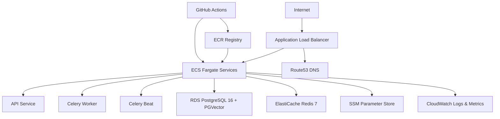

# Terraform Infrastructure - FreightHero Watchtower

This directory contains the Terraform infrastructure-as-code for the FreightHero Watchtower platform on AWS.

## 📁 Structure

```
infra/terraform/
├── main.tf                    # Root module (composition)
├── variables.tf               # Root variables
├── outputs.tf                 # Root outputs
├── locals.tf                 # Local values
├── environments/
│   ├── dev/main.tf           # Development environment
│   ├── staging/main.tf       # Staging environment
│   └── prod/main.tf          # Production environment
└── modules/
    ├── vpc/                  # VPC, subnets, NAT gateway, flow logs
    ├── ecs/                  # ECS cluster, services, task definitions, auto-scaling
    ├── rds/                  # PostgreSQL 16 with PGVector support
    ├── elasticache/          # Redis 7 (ElastiCache)
    ├── alb/                  # Application Load Balancer, SSL, Route53
    ├── ecr/                  # Container registry with lifecycle policies
    ├── iam/                  # IAM roles, GitHub Actions OIDC
    ├── cloudwatch/           # Log groups, dashboards, alarms, SNS
    └── ssm/                  # Parameter Store for configuration
```

## 🏗️ Architecture



## 🚀 Quick Start

### Prerequisites

- Terraform >= 1.5.0
- AWS CLI configured with appropriate credentials
- AWS S3 bucket for state storage
- AWS DynamoDB table for state locking

### Initial Setup

1. **Create the S3 bucket and DynamoDB table for state:**

```bash
aws s3api create-bucket \
  --bucket freighthero-terraform-state \
  --region us-east-1

aws dynamodb create-table \
  --table-name freighthero-terraform-locks \
  --attribute-definitions AttributeName=LockID,AttributeType=S \
  --key-schema AttributeName=LockID,KeyType=HASH \
  --billing-mode PAY_PER_REQUEST
```

2. **Set required variables:**

```bash
export TF_VAR_db_password="your-secure-password"
```

3. **Initialize and apply for dev:**

```bash
cd infra/terraform/environments/dev
terraform init
terraform plan
terraform apply
```

### Deploying to Different Environments

```bash
# Development
cd infra/terraform/environments/dev
terraform init
terraform plan -var="db_password=$DB_PASSWORD_DEV"
terraform apply -var="db_password=$DB_PASSWORD_DEV"

# Staging
cd infra/terraform/environments/staging
terraform init
terraform plan -var="db_password=$DB_PASSWORD_STAGING"
terraform apply -var="db_password=$DB_PASSWORD_STAGING"

# Production (requires manual approval)
cd infra/terraform/environments/prod
terraform init
terraform plan -var="db_password=$DB_PASSWORD_PROD"
terraform apply -var="db_password=$DB_PASSWORD_PROD"
```

## 🔧 Module Details

### VPC Module
- Creates VPC with public/private subnets across multiple AZs
- NAT Gateways for private subnet egress
- VPC Flow Logs to CloudWatch
- Internet Gateway for public subnets

### ECS Module
- Fargate-based ECS cluster with Container Insights
- API service (FastAPI) with health checks
- Celery worker service for async task processing
- Celery beat service for scheduled tasks
- Auto-scaling for API service (CPU/Memory based)
- IAM roles for task execution and application permissions

### RDS Module
- PostgreSQL 16 with PGVector extension support
- Automated backups (7 days prod, 1 day dev)
- Performance Insights enabled in production
- Encryption at rest and in transit
- Deletion protection in production

### ElastiCache Module
- Redis 7 with LRU eviction policy
- Encryption at rest and in transit
- Automatic failover in production (2 nodes)
- Single node in dev/staging

### ALB Module
- Application Load Balancer with HTTPS redirect
- ACM certificate management (auto or manual)
- Route53 DNS records
- Health checks on `/health` endpoint
- Access logs to S3 with lifecycle policies

### ECR Module
- Container image registry
- Image scanning on push
- Lifecycle policies (keep last 10 tagged, remove untagged after 1 day)
- Immutable tags in production

### CloudWatch Module
- Log groups for all services
- Dashboard with ECS, RDS, and ElastiCache metrics
- Alarms for CPU, memory, storage, and health checks
- SNS topic for alarm notifications

### IAM Module
- GitHub Actions OIDC provider for CI/CD
- ECR push/pull permissions
- ECS deploy permissions
- SSM parameter read access

### SSM Module
- Database endpoint parameter
- Redis endpoint parameter
- Environment configuration parameters

## 🔐 Security

- All sensitive variables are marked as `sensitive`
- RDS and Redis encryption at rest and in transit
- VPC Flow Logs enabled
- Security groups follow least-privilege
- IAM roles use OIDC federation (no long-lived keys)
- S3 access logs for ALB
- ECS exec logging enabled

## 📊 Monitoring

- CloudWatch Dashboard with:
  - ECS CPU/Memory utilization
  - RDS connections
  - ElastiCache hit/miss ratio
- Alarms for:
  - High CPU (>80%)
  - High memory (>85%)
  - Low RDS storage (<5GB)
  - Unhealthy API hosts
- SNS notifications for all alarms

## 🔄 CI/CD

The GitHub Actions workflow (`.github/workflows/terraform.yml`) provides:

1. **Format & Validate** - on every PR
2. **Plan** - on PRs (dev, staging, prod)
3. **Auto-apply** - on push to `develop` (dev) and `main` (prod)

Required GitHub Secrets:
- `AWS_ROLE_ARN_DEV` - IAM role ARN for dev
- `AWS_ROLE_ARN_STAGING` - IAM role ARN for staging
- `AWS_ROLE_ARN_PROD` - IAM role ARN for prod
- `DB_PASSWORD_DEV` - Dev database password
- `DB_PASSWORD_STAGING` - Staging database password
- `DB_PASSWORD_PROD` - Production database password